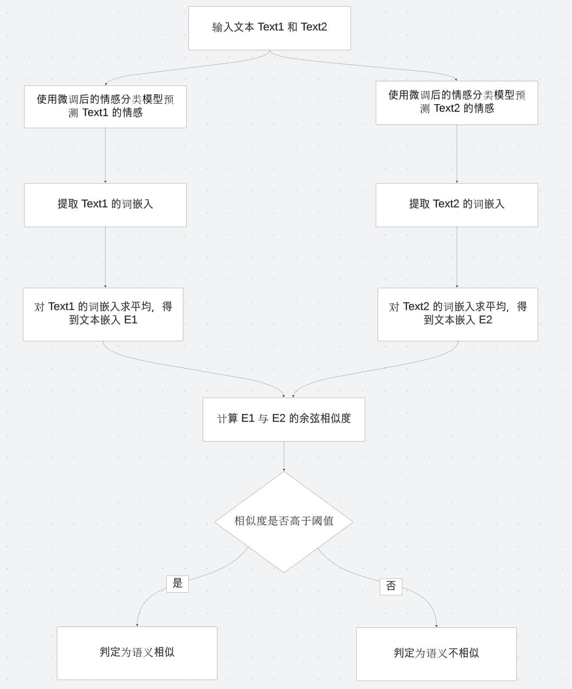

# 机器学习实验报告/大作业2

|   学号   |  姓名  |
| :------: | :----: |
| 22336221 | 汪宣彤 |


### 一、实验要求

**【问题描述】**

设计并实现一个基于Transformer架构的小型GPT，能够进行简单的对话。请根据以下要求完成实验并提交报告和代码

 

**【数据集】**

数据集地址：https://drive.google.com/file/d/1nEuew_KNpTMbyy7BO4c8bXMXN351RCPp/view

数据集大约有50万条数据，不一定要用到全部数据，也可以将较长的对话舍弃，可以根据自己电脑的算力情况调整


情感分类数据集：https://raw.githubusercontent.com/SophonPlus/ChineseNlpCorpus/master/datasets/ChnSentiCorp_htl_all/ChnSentiCorp_htl_all.csv 


**【任务要求】**

1. ##### 数据预处理

   创建一个词汇表，将字符映射到唯一的 ID，并生成反向映射

   注意，除了需要将数据集中出现的字符映射为 ID 外，还需要一些额外的处理：

   - `<pad>`：用于填充的特殊标记
   - `<unk>`：表示未知单词
   - `<sep>`：分隔符，用于区分不同的文本片段或部分
     - 例如：你喜欢什么？`<sep>` 我喜欢学习

   

2. ##### 模型搭建与训练

   基于Transformer实现一个小型GPT模型

   根据自己的算力情况设置合适的参数（训练轮数、解码器个数）

   建议在训练过程中保存中间模型（比如每5个 `epoch` 保存一个 `checkpoint`）

   

3. ##### 对话生成

   实现一个简单的对话接口，能够接受用户输入并生成相应的回复

   

4. ##### 微调实现情感分类

   

   

5. ##### 给定两个文本 Text1 和 Text2，如何微调 GPT 判断两个文本语义是否相似？


**【实验报告（内容包括但不限于以下部分）】**

1. 数据预处理的方法
2. 所实现的GPT模型的结构，以及参数
3. 模型测试效果截图（最少3次交互对话，每次至少10句话） 
4. 情感分类的准确率（至少500条数据做测试，比较训练所有层 vs 仅训练输出层和最后一个transformer块，禁用mask结果怎么样及为什么）
5. 如何实现判断文本语义相似度（只需回答问题无需训练模型，要详细，画图+文字说明+解释原因）
6. 实验结果分析与讨论


### 二、实验1：小型GPT模型的搭建与实现

#### 实验步骤

##### 数据预处理（`data_process_a.py`）

**加载数据**

使用 `load_data` 函数加载对话数据，并分组、清洗，同时过滤过短或过长的句子，最终将对话内容组织为问答对

```python
def load_data(file_path):
    data = []
    with open(file_path, 'r', encoding='utf-8') as f:
        content = f.read()
        groups = content.split("\n\n")  # 按空行分组

        for group in groups:
            lines = [line.strip() for line in group.split("\n") if line.strip()]
            # 过滤过短、过长句子
            lines = [line for line in lines if MIN_SEQ_LENGTH <= len(line) <= MAX_SEQ_LENGTH]

            # 构建问答对
            for i in range(len(lines) - 1):
                data.append((lines[i], lines[i + 1]))

    print(f"Loaded {len(data)} dialogue samples.")
    return data
```


**构建词汇表**

使用 `build_vocab` 函数统计对话数据中每个字符的出现频率，并保留前 `VOCAB_SIZE_LIMIT` 个最常见字符。生成的词汇表包含四个特殊标记（`<pad>`、`<unk>`、`<sep>`、`<eos>`）

```python
def build_vocab(data, vocab_size_limit=VOCAB_SIZE_LIMIT):
    counter = Counter()
    for sample in data:
        for sentence in sample:
            counter.update(sentence)  # 统计字符频率

    # 保留前N个最常见字符，并且添加特殊标记
    most_common = counter.most_common(vocab_size_limit)
    vocab = {PAD_TOKEN: 0, UNK_TOKEN: 1, SEP_TOKEN: 2, EOS_TOKEN: 3}  # 特殊标记初始化
    vocab.update({char: idx + 4 for idx, (char, _) in enumerate(most_common)})  # 更新词汇表

    print(f"Vocabulary built with {len(vocab)} tokens.")
    return vocab
```


**转换字符为ID**

使用 `convert_to_ids` 函数将问答对中的每个字符转换为词汇表中的唯一ID，同时添加特殊标记 `<sep>` 和 `<eos>`

```python
def convert_to_ids(data, vocab, max_length=MAX_SEQ_LENGTH):
    def encode(sentence):
        return [vocab.get(char, vocab[UNK_TOKEN]) for char in sentence[:max_length]]

    encoded_data = []
    for question, answer in data:
        question_ids = encode(question) + [vocab[SEP_TOKEN]]
        answer_ids = encode(answer) + [vocab[EOS_TOKEN]]  # 添加结束标记
        encoded_data.append((question_ids, answer_ids))

    print(f"Converted {len(encoded_data)} samples to ID format.")
    return encoded_data
```


**保存词汇表和反向词汇表**

将词汇表和反向词汇表保存为 `JSON` 文件，供后续模型训练和生成使用

```python
def save_vocab(vocab, save_path, reverse_save_path):
    with open(save_path, 'w', encoding='utf-8') as f:
        json.dump(vocab, f, ensure_ascii=False, indent=4)
    print(f"Vocabulary saved to {save_path}.")

    # 生成反向词汇表
    reverse_vocab = {idx: token for token, idx in vocab.items()}
    with open(reverse_save_path, 'w', encoding='utf-8') as f:
        json.dump(reverse_vocab, f, ensure_ascii=False, indent=4)
    print(f"Reverse vocabulary saved to {reverse_save_path}.")
```


**运行结果**

得到 `vocab.json`,`reverse_vocab.json`


##### 小型 GPT 模型的搭建与训练（`gpt.py` ）

**数据处理**

加载对话数据并将其转换为 ID 表示，同时根据设备性能，对数据集规模进行一定的限制以提高训练效率

```python
from data_process_a import load_data, convert_to_ids  # 从 a.py 导入加载和转换函数

# 加载对话数据
dialogue_data = load_data("train.txt")
with open("vocab.json", "r", encoding="utf-8") as f:
    vocab = json.load(f)
dialogue_data = convert_to_ids(dialogue_data, vocab, max_length=MAX_SEQ_LENGTH)

# 减少数据集规模
def reduce_dataset_size(data, max_samples=300000):
    if len(data) > max_samples:
        random.shuffle(data)
        data = data[:max_samples]
    print(f"Reduced dataset size: {len(data)} samples.")
    return data

dialogue_data = reduce_dataset_size(dialogue_data, max_samples=MAX_SAMPLES)
```


**数据集和数据加载器的创建**

使用 `DialogueDataset` 类，将问答对数据转换为 PyTorch 张量格式，并通过 `DataLoader` 进行批量化处理

```python
class DialogueDataset(Dataset):
    def __init__(self, data, max_seq_length=40, pad_idx=0):
        self.data = data
        self.max_seq_length = max_seq_length
        self.pad_idx = pad_idx

    def __len__(self):
        return len(self.data)

    def __getitem__(self, idx):
        question, answer = self.data[idx]
        question = self.pad_sequence(question)
        answer = self.pad_sequence(answer)
        return torch.tensor(question), torch.tensor(answer)

    def pad_sequence(self, sequence):
        if len(sequence) > self.max_seq_length:
            return sequence[: self.max_seq_length]
        else:
            return sequence + [self.pad_idx] * (self.max_seq_length - len(sequence))

# 创建数据集和数据加载器
dataset = DialogueDataset(dialogue_data, max_seq_length=MAX_SEQ_LENGTH, pad_idx=PAD_IDX)
data_loader = DataLoader(dataset, batch_size=BATCH_SIZE, shuffle=True)
```


**模型搭建**

定义一个基于 Transformer 解码器的小型 GPT 模型，包含嵌入层、位置编码、Transformer 解码器和全连接层

```python
class SmallGPT(nn.Module):
    def __init__(self, vocab_size, embed_dim, num_layers, num_heads, ffn_dim, dropout, pad_idx):
        super(SmallGPT, self).__init__()
        self.embedding = nn.Embedding(vocab_size, embed_dim, padding_idx=pad_idx)
        self.positional_encoding = nn.Parameter(
            torch.zeros(1, MAX_SEQ_LENGTH, embed_dim)
        )  # 可训练的位置编码
        self.decoder_layer = nn.TransformerDecoderLayer(
            d_model=embed_dim,
            nhead=num_heads,
            dim_feedforward=ffn_dim,
            dropout=dropout,
            batch_first=True
        )
        self.decoder = nn.TransformerDecoder(self.decoder_layer, num_layers=num_layers)
        self.fc_out = nn.Linear(embed_dim, vocab_size)

    def forward(self, src, tgt):
        # src 是输入序列，tgt 是目标序列
        src_emb = self.embedding(src) + self.positional_encoding[:, : src.size(1), :]
        tgt_emb = self.embedding(tgt) + self.positional_encoding[:, : tgt.size(1), :]
        output = self.decoder(tgt=tgt_emb, memory=src_emb)  # Decoder-only
        logits = self.fc_out(output)
        return logits
```


**模型训练**

定义训练函数，使用交叉熵损失函数（忽略 `<pad>` 索引）和 AdamW 优化器。每次训练后保存模型检查点

```python
def train_model(model, data_loader, optimizer, scheduler, criterion, epochs, device):
    model.to(device)
    for epoch in range(1, epochs + 1):
        model.train()
        epoch_loss = 0
        for question, answer in tqdm(data_loader, desc=f"Epoch {epoch}/{epochs}"):
            question, answer = question.to(device), answer.to(device)

            # tgt_input 和 tgt_target 是 shifted
            tgt_input = answer[:, :-1]
            tgt_target = answer[:, 1:]

            optimizer.zero_grad()
            output = model(question, tgt_input)
            loss = criterion(output.view(-1, model.fc_out.out_features), tgt_target.contiguous().view(-1))
            loss.backward()
            optimizer.step()
            scheduler.step()

            epoch_loss += loss.item()

        print(f"Epoch {epoch}/{epochs} Loss: {epoch_loss / len(data_loader):.4f}")

        # 保存模型
        if epoch % SAVE_EVERY == 0:
            torch.save(model.state_dict(), f"model_epoch_{epoch}.pt")
            print(f"Model checkpoint saved at epoch {epoch}.")
```


**模型总体架构**

- **嵌入层**：将输入的 token ID 转换为固定维度的嵌入向量
- **位置编码**：为输入序列提供位置信息，模型通过位置编码感知序列中的顺序关系
- **Transformer 解码器层**：堆叠多个解码器层，每层包含：
  - 多头自注意力机制
  - 前馈神经网络
- **输出层**：通过线性变换，将解码器的输出映射到词汇表大小的概率分布，用于生成下一个 token


**模型超参数设置**

- **嵌入层**
  - 嵌入维度：`EMBED_DIM = 128`
- **位置编码**
  - `positional_encoding`：一个可训练参数矩阵，形状为 `(1, MAX_SEQ_LENGTH, EMBED_DIM)`
- **Transformer 解码器**
  - 解码器层数：`NUM_LAYERS = 2`
  - 多头注意力的头数：`NUM_HEADS = 4`
  - 前馈神经网络隐藏层维度：`FFN_DIM = 256`
  - Dropout 比例：`DROPOUT = 0.1`
- **输出层**
  - `fc_out`：一个全连接层，形状为 `(EMBED_DIM, vocab_size)`


**运行结果**

考虑到设备性能问题，对超参数的设置以及数据规模进行一定的限制，最终总计训练约7个小时，最终损失为 `0.0514`，训练过程中每2个epoch保存


##### 对话生成（`generate_response.py`）

**加载必要资源**

- 加载词汇表（`vocab.json`）并检查其完整性，确保包含所有特殊标记
- 加载训练好的小型 GPT 模型权重（默认 `model_epoch_10.pt`）

```python
# 加载词汇表
with open("vocab.json", "r", encoding="utf-8") as f:
    vocab = json.load(f)
token_to_idx = vocab
idx_to_token = {idx: token for token, idx in vocab.items()}

# 检查词汇表是否包含所有特殊标记
required_tokens = [PAD_IDX, UNK_IDX, SEP_IDX, EOS_IDX]
missing_tokens = [token for token in required_tokens if token not in token_to_idx.values()]
if missing_tokens:
    print(f"Warning: Missing tokens in vocabulary: {missing_tokens}")

# 加载训练好的模型
model = SmallGPT(
    vocab_size=len(vocab),
    embed_dim=EMBED_DIM,
    num_layers=NUM_LAYERS,
    num_heads=NUM_HEADS,
    ffn_dim=FFN_DIM,
    dropout=DROPOUT,
    pad_idx=PAD_IDX,
)
model.load_state_dict(torch.load("model_epoch_10.pt"))
print("Model loaded successfully.")
```


**Top-k 和 Top-p 策略**

定义用于生成的 `top_k` 和 `top_p` 策略以控制输出的多样性和质量

```python
def top_k_top_p_filtering(logits, top_k=0, top_p=0.0, filter_value=-float('Inf')):
    if top_k > 0:
        indices_to_remove = logits < torch.topk(logits, top_k)[0][..., -1, None]
        logits[indices_to_remove] = filter_value

    if top_p > 0.0:
        sorted_logits, sorted_indices = torch.sort(logits, descending=True)
        cumulative_probs = torch.cumsum(torch.softmax(sorted_logits, dim=-1), dim=-1)

        sorted_indices_to_remove = cumulative_probs > top_p
        if sorted_indices_to_remove[..., 0].item():
            sorted_indices_to_remove[..., 1:] = sorted_indices_to_remove[..., :-1].clone()
            sorted_indices_to_remove[..., 0] = 0

        indices_to_remove = sorted_indices[sorted_indices_to_remove]
        logits[indices_to_remove] = filter_value

    return logits
```


**生成响应（对话生成）**

通过 `generate_response` 函数生成对话回复，具体步骤包括：

- 将输入文本转为 ID 序列
- 对生成序列逐步预测下一 token，直到达到最大长度或生成结束标记 `<eos>`
- 应用温度缩放（`temperature`）、Top-k 策略（`top_k`）、重复惩罚（`repetition_penalty`）等方法增强生成质量

```python
def generate_response(model, input_text, token_to_idx, idx_to_token, max_length=30, top_k=100, temperature=1.2, repetition_penalty=1.5):
    device = torch.device("cuda" if torch.cuda.is_available() else "cpu")
    model.to(device)
    model.eval()

    # 将输入文本转换为 ID 序列
    input_ids = [token_to_idx.get(char, token_to_idx.get("<unk>")) for char in input_text[:MAX_SEQ_LENGTH]]
    input_tensor = torch.tensor([input_ids], device=device)

    # 初始化生成序列
    generated_ids = [SEP_IDX]  # 用分隔符标记作为起始标记
    generated_tensor = torch.tensor([generated_ids], device=device)

    for _ in range(max_length):
        # 前向传播：生成下一个 token 的 logits
        logits = model(input_tensor, generated_tensor)
        next_token_logits = logits[0, -1, :]

        # 应用温度缩放
        next_token_logits = next_token_logits / temperature

        # 使用 Top-k 策略过滤低概率
        filtered_logits = top_k_top_p_filtering(next_token_logits, top_k=top_k)

        # 引入重复惩罚
        for token_id in set(generated_ids):
            filtered_logits[token_id] /= repetition_penalty  # 对已生成 token 进行惩罚

        # 根据概率采样下一个 token
        probs = F.softmax(filtered_logits, dim=-1)
        next_token_id = torch.multinomial(probs, num_samples=1).item()

        # 如果生成结束标记，则停止生成
        if next_token_id == EOS_IDX:
            break

        # 避免连续生成完全无意义的字符
        if len(generated_ids) > 1 and next_token_id == generated_ids[-1]:
            continue  # 跳过连续重复的 token

        # 将生成的 token 添加到序列中
        generated_ids.append(next_token_id)
        generated_tensor = torch.tensor([generated_ids], device=device)

    # 将生成的 ID 序列转换为文本
    generated_text = "".join([idx_to_token[idx] for idx in generated_ids if idx not in [PAD_IDX, UNK_IDX, SEP_IDX, EOS_IDX]])
    return generated_text.strip()  # 去掉多余空格
```


**交互测试**

在主函数中提供交互式测试界面，让用户输入内容，并生成相应的回复

```python
print("\n--- Chat Interface ---")
print("Type 'exit' to quit.")
while True:
    input_text = input("You: ").strip()
    if not input_text:
        print("Error: Input cannot be empty.")
        continue
    if input_text.lower() == "exit":
        break
    response = generate_response(model, input_text, token_to_idx, idx_to_token)
    print(f"Bot: {response}")
```


#### 实验结果及其分析

##### 对话生成结果


##### 实验结果分析

由于训练数据规模较小，模型的参数设置有限，模型生成的回答无法结合上下文语境进行深度理解和推理，回答中存在大量无意义或不相关内容，后续考虑可以从数据覆盖以及参数设置的角度进行优化


#### 问题记录

在实验过程中，虽然在 `data_process_a.py` 文件中成功生成了反向映射文件，但在 `generate_response.py`文件中直接使用该反向映射文件时，未能正确输出结果，因此在实际输出中，在 `generate_response.py` 又进行了一次映射


**实际运行时进行映射时使用的代码**

```python
with open("vocab.json", "r", encoding="utf-8") as f:
        vocab = json.load(f)
    token_to_idx = vocab
    idx_to_token = {idx: token for token, idx in vocab.items()}
```


**失败输出示例**


### 三、实验2：情感分类

#### 实验步骤

##### 数据预处理（`data_process_b.py`）

**读取数据集**

从 `ChnSentiCorp_htl_all.csv` 中读取情感数据集，并去掉数据中包含缺失值的样本，并重置索引

```python
data = pd.read_csv('ChnSentiCorp_htl_all.csv')

# 去掉包含缺失值的样本
data = data.dropna(subset=['review', 'label']).reset_index(drop=True)
```


**数据平衡**

- 将数据按照情感标签分为两类（正面 `label=1` 和负面 `label=0`）
- 找到数量较少的一类样本数 `n_samples`，并使两类样本数量一致

```python
# 分别获取标签为0和1的数据
data_0 = data[data['label'] == 0].reset_index(drop=True)
data_1 = data[data['label'] == 1].reset_index(drop=True)

# 取数量较少的一类的数量，确保数据平衡
n_samples = min(len(data_0), len(data_1))

# 从两类中各取n_samples条数据
balanced_data_0 = data_0.head(n_samples)
balanced_data_1 = data_1.head(n_samples)
```


**分割训练集和测试集**

从平衡后的数据集中，随机抽取 250 个正样本和 250 个负样本作为测试集，其余数据作为训练集

```python
# 从平衡数据集中随机选择250个正样本和250个负样本作为测试集
test_data_0 = balanced_data_0.sample(n=250, random_state=42)
test_data_1 = balanced_data_1.sample(n=250, random_state=42)
test_data = pd.concat([test_data_0, test_data_1], ignore_index=True)

# 剩余的数据作为训练集
train_data_0 = balanced_data_0.drop(test_data_0.index).reset_index(drop=True)
train_data_1 = balanced_data_1.drop(test_data_1.index).reset_index(drop=True)
train_data = pd.concat([train_data_0, train_data_1], ignore_index=True)
```


**扩展词汇表**

- 将训练集中的所有文本拼接为一个字符串
- 提取文本中的所有字符，并检查是否存在于现有词汇表中
- 将新的字符添加到词汇表中，并为每个新字符分配一个唯一的 ID

```python
# 扩展词汇表：将情感数据集中的新字符添加到现有词汇表中
all_text = ''.join(map(str, train_data['review']))
chars = set(all_text)

# 添加新字符到词汇表
max_id = max(vocab.values())
for char in chars:
    if char not in vocab:
        max_id += 1
        vocab[char] = max_id
```


**运行结果**


##### 模型优化（`gpt_optimization.py`）

在先前的GPT模型搭建时并没有启用Mask，因此在本实验中修改先前的模型，启用Mask

```python
# 生成 tgt_mask，用于防止 decoder 访问未来的 token
def generate_square_subsequent_mask(self, size):
	mask = torch.triu(torch.ones(size, size), diagonal=1)
	return mask.masked_fill(mask == 1, float('-inf')).masked_fill(mask == 0, float(0.0))

# 生成 padding mask，用于屏蔽填充位置（PAD_IDX）
def create_padding_mask(self, seq):
	return (seq == PAD_IDX)  # 直接返回 2D 的布尔张量
```


##### 模型训练（`train.py`）

**定义优化器和损失函数**

- 使用 AdamW 优化器，学习率为 `1e-4`
- 使用交叉熵损失函数 (`CrossEntropyLoss`)

```python
# 定义优化器和损失函数
optimizer = optim.AdamW(model.parameters(), lr=LEARNING_RATE)
criterion = nn.CrossEntropyLoss()
```


**定义训练函数**

- 设置模型为训练模式 (`model.train()`)
- 遍历数据加载器 (`train_loader`)，取出每个批次的输入和标签
- 前向传播计算输出，计算损失，反向传播更新模型参数
- 累积所有批次的平均损失，作为当前轮次的训练损失

```python
def train_model(model, train_loader, optimizer, criterion, device):
    model.train()
    total_loss = 0
    for inputs, labels in train_loader:
        inputs, labels = inputs.to(device), labels.to(device)

        optimizer.zero_grad()  # 梯度清零
        outputs = model(inputs, inputs)  # 使用输入作为源和目标
        logits = outputs[:, -1, :]  # 获取最后一个时间步的输出
        loss = criterion(logits, labels)  # 计算损失
        loss.backward()  # 反向传播
        optimizer.step()  # 参数更新

        total_loss += loss.item()
    return total_loss / len(train_loader)
```


**定义评估函数**

- 设置模型为评估模式 (`model.eval()`)
- 遍历测试数据加载器，获取模型预测输出
- 计算测试集的分类准确率

```python
# 测试函数
def evaluate_model(model, test_loader, device):
    model.eval()
    all_preds = []
    all_labels = []
    with torch.no_grad():  # 禁用梯度计算
        for inputs, labels in test_loader:
            inputs, labels = inputs.to(device), labels.to(device)
            outputs = model(inputs, inputs)
            logits = outputs[:, -1, :]  # 获取最后一个时间步的输出
            preds = torch.argmax(logits, dim=-1)  # 获取预测类别
            all_preds.extend(preds.cpu().numpy())
            all_labels.extend(labels.cpu().numpy())
    accuracy = accuracy_score(all_labels, all_preds)
    return accuracy
```


**训练和评估**

循环训练若干轮，在每轮训练后，计算测试集上的分类准确率，并打印当前轮次的损失和准确率

```python
for epoch in range(EPOCHS):
    train_loss = train_model(model, train_loader, optimizer, criterion, device)
    test_accuracy = evaluate_model(model, test_loader, device)
    print(f"Epoch {epoch + 1}/{EPOCHS}")
    print(f"Train Loss: {train_loss:.4f}")
    print(f"Test Accuracy: {test_accuracy:.4f}")
```


**运行结果**


**分析**

- **性能表现**
  - 训练损失
    - 初始（Epoch 1）：2.0609
    - 最终（Epoch 20）：0.2965
  - 测试准确率
    - 初始（Epoch 1）：61.60%
    - 峰值（Epoch 15）：77.20%
    - 最终（Epoch 20）：75.00%
- **解释**
  - 模型的训练损失显著下降，表明模型的学习过程顺利
  - 测试准确率在前期逐步提高，最高达到77.20%。然而，随着训练的进行，测试准确率呈现下降趋势，最终停留在75.00%
  - 这种下降趋势可能是由于模型出现了**轻微的过拟合现象**，尽管训练损失持续下降，但测试集的准确率没有持续增长


##### 只训练最后一层(`freeze_train.py`)

```python
# 冻结所有参数
for param in model.parameters():
    param.requires_grad = False

# 解冻最后一个 Transformer 块和输出层的参数
for param in model.decoder.layers[-1].parameters():
    param.requires_grad = True
for param in model.fc_out.parameters():
    param.requires_grad = True

# 确保只训练解冻的参数
optimizer = optim.AdamW(filter(lambda p: p.requires_grad, model.parameters()), lr=LEARNING_RATE)
criterion = nn.CrossEntropyLoss()
```


**运行结果**


**分析**

- **性能表现**

  - 训练损失
    - 初始（Epoch 1）：2.7687
    - 最终（Epoch 20）：0.4966
  - 测试准确率
    - 初始（Epoch 1）：56.40%
    - 峰值（Epoch 19）：75.60%
    - 最终（Epoch 20）：73.60%

- **解释**
- 相比训练所有层，测试准确率后期波动较小，表现较为稳定
  
- 此时显著降低了过拟合风险，测试准确率相对稳定
  - 泛化能力较好，但最高准确率略低于训练所有层的结果，表明模型表达能力存在一定限制


##### 性能评估（`performance_evaluation.py`）

**定义评估函数**

- 遍历测试数据加载器，获取模型的预测值和真实标签
- 计算模型在测试集上的分类准确率和分类报告
- 禁用梯度计算（`torch.no_grad()`），以提高效率
- 对每个批次的输入
  - 前向传播，获取模型预测输出
  - 提取最后一个时间步的 `logits`，并根据 `argmax` 获取预测类别
- 使用 `sklearn` 的 `accuracy_score` 和 `classification_report` 计算性能指标

```python
def evaluate_model(model, test_loader, device):
    all_preds = []
    all_labels = []
    with torch.no_grad():
        for inputs, labels in test_loader:
            inputs, labels = inputs.to(device), labels.to(device)
            outputs = model(inputs, inputs)  # 情感分类任务，使用输入作为源和目标
            logits = outputs[:, -1, :]  # 获取最后一个时间步的输出
            preds = torch.argmax(logits, dim=-1)  # 获取预测类别
            all_preds.extend(preds.cpu().numpy())
            all_labels.extend(labels.cpu().numpy())

    # 计算准确率和分类报告
    accuracy = accuracy_score(all_labels, all_preds)
    report = classification_report(all_labels, all_preds, target_names=["Negative", "Positive"])
    return accuracy, report
```


**运行结果**


**分析**

- **测试准确率对比**
  - **Model 1（训练所有层）**
    - 测试准确率：**75.00%**
    - **优势**：通过训练所有层，模型能够更全面地调整网络权重，更好地适应当前任务。因此在测试集上的表现略优于 Model 2。
    - 表现特点
      - 对 `Positive` 类别的召回率较高（0.83），说明模型在检测正类时有更好的覆盖
      - 对 `Negative` 类别的精确率较高（0.80），表明模型对负类的判断更准确
  - **Model 2（只训练最后一层）**
    - 测试准确率：**73.60%**
    - **优势**：只训练最后一层使模型在有限数据上具有更好的泛化能力，训练效率更高，且测试准确率接近 Model 1
    - 表现特点
      - 对 `Positive` 类别的召回率为 0.81，略低于 Model 1（0.83），但仍然表现不错
      - 整体表现稍逊于 Model 1，但**模型更稳定，过拟合风险更低**
- **学习效率与过拟合风险**
  - Model 1（训练所有层）
    - **学习效率**：训练所有层需要更新全部参数，因此训练时间较长，计算复杂度高
    - **过拟合风险**：模型在测试集上的表现略优于训练集，但训练所有层的策略更容易对训练数据过度拟合，泛化能力稍弱
  - Model 2（只训练最后一层）
    - **学习效率**：只更新最后一层的参数，训练速度快，计算成本低
    - **过拟合风险**：由于冻结了大部分预训练权重，过拟合风险较低，泛化能力更好，因此在测试集上表现较为稳定


##### 禁用mask（`gpt_no_mask.py`）

```python
def forward(self, src, tgt):
	# 动态调整位置编码大小
	src_emb = self.embedding(src) + self.positional_encoding[:, : src.size(1), :]
	tgt_emb = self.embedding(tgt) + self.positional_encoding[:, : tgt.size(1), :]
	output = self.decoder(tgt=tgt_emb, memory=src_emb)
	logits = self.fc_out(output)
	return logits
```


**运行结果**


**分析**

- 测试准确率在 Epoch 3 达到 0.6640，随后缓慢提升，最终在 Epoch 13 达到最高值 0.7540，在训练后期，准确率波动较大，后续下降到 0.7300

- 性能对比

  - **测试准确率的对比**
    - 启用 Mask 的准确率更高
      - 启用 Mask 的模型在测试集上表现更稳定，最高测试准确率更高，且后期没有显著的下降
      - 禁用 Mask 的模型在后期（Epoch 15~20）出现了明显的准确率波动，表明模型的泛化能力较弱
  - **波动现象**
    - 禁用 Mask 的模型在测试准确率上波动较大，尤其是后期较为明显
    - 启用 Mask 的模型则更加稳定，这说明 Mask 的作用在抑制过拟合上起到了重要作用

- **禁用 Mask 的影响**

  - **自回归特性的丧失**

    Mask 的作用是限制目标序列中的每个位置只能看到前面的 token，禁用 Mask 后，模型可以看到目标序列中所有位置的 token（包括未来位置），这导致：

    - **训练阶段**：模型可能过度依赖未来信息，而不是学会逐步生成序列
    - **测试阶段**：模型无法适应自回归的逐步生成过程，从而影响生成质量

  - **学习行为的变化**

    禁用 Mask 后，模型的注意力机制可以访问整个目标序列，因此可能会学习到不符合自回归规则的特征

  - **泛化能力的下降**

    禁用 Mask 的模型更容易过拟合，因为它可以利用未来 token 的信息进行优化，导致模型无法在测试集上表现稳定


### 四、实验3：语义相似度判断

#### 实验思路和步骤

##### 文本预处理

**目标**：精简并标准化输入文本，确保数据的质量，使模型更容易处理

- **分词**：使用 BPE 或 WordPiece 进行分词，保证对文本的细粒度处理，尤其是情感词汇和情感短语的分割
- **去除停用词**：去除停用词（如“的”、“了”、“和”等），减少不必要的噪声
- **文本标准化**：清除文本中的特殊字符、标点符号，统一转为小写，确保输入文本的一致性，避免由于大小写、符号等差异引入的不必要干扰


##### 模型微调

**目标**：将预训练模型微调为情感分类模型

- **加载预训练模型**：使用预训练的GPT模型作为初始模型
- **微调**：通过监督学习训练模型进行情感分类。模型通过输入文本并预测其情感类别，训练时使用交叉熵损失函数来优化模型的预测准确度
- **训练过程**
  - 输入文本，获取模型的输出
  - 使用情感标签与预测结果计算损失，反向传播更新模型参数
  - 使用 AdamW 优化器进行优化，设定合适的学习率和权重衰减
- **微调策略**
  - 采用梯度累积和早停策略，避免过拟合
  - 选择性冻结某些层的参数，仅微调最后几层，以减少训练时间并提高模型的稳定性


##### 文本向量化

**目标**：将文本转换为语义嵌入向量，便于相似度计算。

- **生成文本嵌入**：将预处理后的文本输入微调后的模型，提取语义嵌入表示
- **获取文本表示**：对每个文本的词嵌入进行加权平均或直接使用整句嵌入，生成文本的整体向量表示


##### 计算情感分类结果与余弦相似度

**目标**：通过计算语义嵌入的余弦相似度，判断文本的语义相似性

- 余弦相似度公式 
  $$
  \text{Cosine Similarity}(A, B) = \frac{A \cdot B}{\|A\| \|B\|}
  $$
  


##### 相似度评分与判断

**目标**：结合余弦相似度的结果，判断两个文本是否在语义上相似

- **设定阈值**：为判断文本相似性，设定一个阈值，如果余弦相似度 > 阈值，则认为两个文本在语义上相似，反之不相似


#### 流程图

