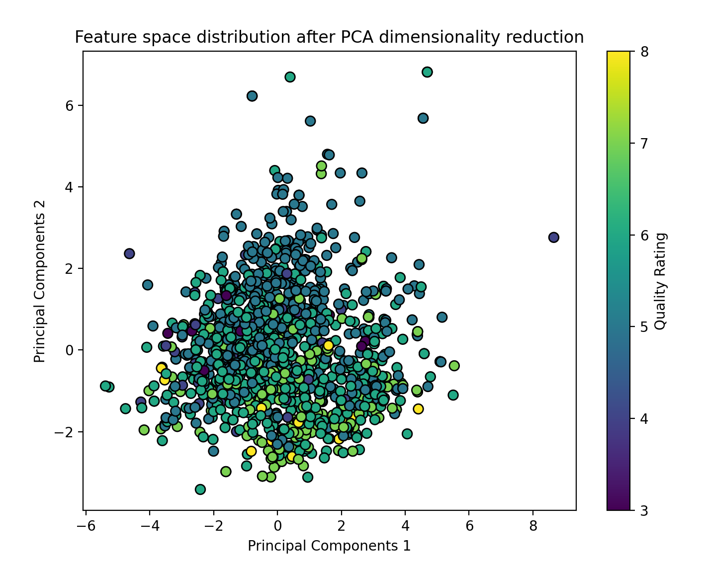
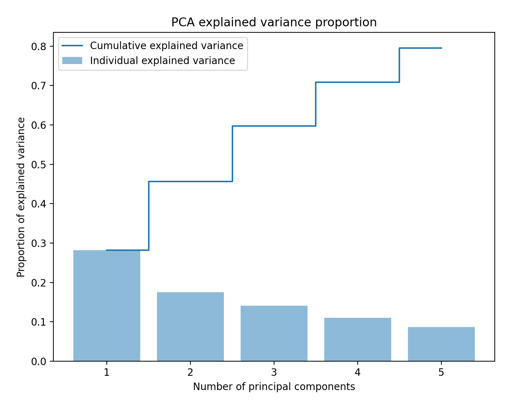

# 机器学习实验报告/大作业3

|   学号   |  姓名  |
| :------: | :----: |
| 22336221 | 汪宣彤 |


### 一、实验要求

#### 使用PCA降维和决策树分类器实践

##### 【数据集】

Wine Quality数据集中的红酒数据集 **winequality-red.csv**

数据集地址：https://archive.ics.uci.edu/dataset/186/wine+qualityhttps://archive.ics.uci.edu/dataset/17/breast+cancer+wisconsin+diagnostic

 

##### 【任务要求】

**实验一：PCA降维**

- 数据预处理

  使用pandas加载数据集，并进行标准化处理

- PCA降维

  - 使用PCA对数据进行降维
  - 实验不同的主成分数量（例如2、3、5个主成分），观察数据在降维后特征空间的分布
  - **可视化**降维后的数据，分析信息保留情况

 


**实验二：决策树分类器**

- 构建决策树模型
  - 使用原始数据构建**三种不同策略**的决策树模型（CART、ID3、C4.5）（ID3和C4.5在sklearn中没有对应的库，可使用其他库，如id3-decision-tree，c45)
  - 评估每种模型的性能（使用准确率、混淆矩阵等指标）
- 模型优化
  - 通过调整决策树的参数（如最大深度、最小样本分割数等）优化模型性能
- 讨论
  - 比较不同策略的决策树在性能上的差异
  - 讨论各策略的优缺点及适用场景


**实验三：PCA与决策树结合**

- PCA+决策树
  - 使用PCA降维后的数据构建决策树模型（**选一种决策树即可**）
  - 对比不同降维数量下的决策树性能
- 综合分析
  - 分析PCA降维对决策树分类性能的影响
  - 探讨在降维后，信息损失与模型复杂度之间的权衡


##### 【实验报告】（内容包括但不限于以下部分）

1. PCA和决策树的相关原理分析
2. 比较不同决策树的性能
3. 对比在不同降维数量下的决策树性能
4. 探讨降维后，信息损失和模型复杂度之间的权衡


### 二、实验整体原理分析

#### PCA和决策树的相关原理分析

- ##### **PCA**

  PCA作为无监督降维技术，旨在通过线性变换将数据从高维空间映射到低维空间，同时尽可能保留原数据中的方差，其核心思想是计算数据的协方差矩阵，并通过特征值分解得到主成分，选取包含最大方差的几个主成分进行数据投影

  - **优点**
    - 能有效降低数据的维度，且通常能够保留大部分信息
  - **局限性**
    - 对数据的线性结构有较强假设，非线性关系无法很好捕捉
    - 降维过程中，可能会丢失一些细节信息，导致分类性能下降

- ##### 决策树

  决策树作为基于树形结构的监督学习方法，用于分类或回归任务。通过选择最优特征对数据进行划分，每次划分都旨在最大化信息增益或最小化数据的不纯度

  - **优点**
    - 不需要对数据进行归一化或标准化等预处理
  - **局限性**
    - 在数据噪声较大时，容易发生过拟合
    - 对于某些特征的划分，决策树可能过于依赖某些单一特征，导致泛化能力差

- ##### 决策树算法：CART、ID3和C4.5

  - **CART**：采用**基尼指数**作为划分标准，适用于分类和回归任务，生成二叉树
  - **ID3**：基于**信息增益**选择特征，适用于分类任务，但容易过拟合
  - **C4.5**：改进了ID3，使用**信息增益比**来克服ID3的偏倚，支持连续特征和缺失值处理

- ##### PCA与决策树结合的影响

  - 结合PCA与决策树的优势在于，PCA能保持主要特征信息，同时减少维度，从而降低决策树的计算复杂度，并减少过拟合的风险
  - 然而降维也会带来信息损失，特别是在选择较少主成分时，可能影响分类效果


### 三、实验1：PCA降维

#### 实验原理

##### 主成分分析（PCA）

PCA是一种线性降维技术，目标是通过线性变换将高维数据映射到低维空间，同时尽可能保留原始数据中的信息

- **方差最大化**：通过寻找数据分布的主方向（主成分），使投影后的数据具有最大的方差
- **正交性**：各主成分相互正交，确保无冗余信息
- **特征分解**：通过对协方差矩阵进行特征值分解或奇异值分解，得到对应的特征向量（主成分）和特征值（解释方差）

PCA的降维效果依赖于保留的主成分数量，主成分数量越多，保留的信息越完整


#### 实验步骤

- **数据加载与预处理**

  - 加载数据集
    - 使用 Pandas 加载 `winequality-red.csv` 数据集

  - 特征和标签分离
    - 特征（`X`）为化学属性，标签（`y`）为酒的质量评分
    - 将质量评分转为二分类问题
  - 数据标准化
    - 使用 `StandardScaler` 将特征数据进行标准化处理（均值为 0，标准差为 1），避免特征尺度差异对 PCA 和模型训练的影响

- **PCA降维**

  - 循环不同主成分数量
    - 设定主成分数量为 2、3、5，使用 `PCA` 模块对标准化后的数据进行降维，并记录降维后的结果

- **可视化分析**

  - 图示特征空间分布
    - 将降维后的二维数据（2个主成分）绘制为散点图，展示降维后数据在特征空间的分布，并用颜色表示质量评分


#### 关键代码展示

```python
# 1. 数据加载与预处理
# 加载数据集
data = pd.read_csv('winequality-red.csv', sep=';')

# 检查数据基本信息
print(data.info())
print(data.describe())

# 分离特征和标签
X = data.drop('quality', axis=1)
y = data['quality']

# 标准化处理
scaler = StandardScaler()
X_scaled = scaler.fit_transform(X)

# 2. PCA降维
# 定义不同的主成分数量
n_components_list = [2, 3, 5]

pca_results = {}
explained_variances = {}

for n in n_components_list:
    pca = PCA(n_components=n)
    X_pca = pca.fit_transform(X_scaled)
    pca_results[n] = X_pca
    explained_variances[n] = pca.explained_variance_ratio_
    print(f'主成分数量: {n}')
    print(f'解释方差比例: {explained_variances[n]}')
```


#### 代码输出







#### 实验结果分析

- **数据预处理**

  数据集包含1599条样本和12个特征，其中11个为浮点数特征，1个为整数标签（质量 `quality`），数据无缺失值

- **PCA降维分析**

  - **解释方差比例**

    - 主成分数量为2时，前两个主成分共解释了约45.7%的数据方差（28.2% + 17.5%）
    - 主成分数量为3时，前三个主成分共解释了约59.8%的数据方差（28.2% + 17.5% + 14.1%）
    - 主成分数量为5时，前五个主成分共解释了约80%的数据方差，表明此时较多的信息已经被保留

  - **累计解释方差比例图**

    从累计曲线可以看出，前两个主成分解释了近一半的信息，增加更多主成分后解释方差逐步增加，但增益逐渐递减

- **可视化分析**

  - **二维散点图**

    - PCA降维到二维后，不同质量评分的样本在散点图中存在一定程度的分离，但仍有较大的重叠，说明酒的质量评分可能与化学特征的线性关系有限
    - 数据的分布较为集中，但有少量离群点（例如右上角的点）

  - **解释方差柱状图**

    第一主成分的方差占比明显高于其他主成分，表明其捕捉了数据中最主要的信息

- **总结**

  - **降维效果**

    - PCA降维到2个主成分可以保留约46%的方差信息；当降维到5个主成分时，保留的信息量增加到80%
    - 在实际应用中，主成分数量的选择需要在信息保留和模型复杂性之间权衡
  
- **数据分布分析**
  
  从二维可视化图看，本实验中，酒的质量评分并未完全线性可分


### 四、实验2：决策树分类器

#### 实验原理

- **CART**
  - 基于**基尼指数**选择分裂特征，分裂后每个节点的样本更加纯净
  - 支持二叉树结构，叶节点表示类别或回归值
- **ID3**
  - 使用**信息增益**作为分裂标准，优先选择使信息熵下降最快的特征进行分裂
  - 不支持连续特征，适合离散数据
- **C4.5**
  - 使用**信息增益比**解决信息增益偏向多值特征的问题
  - 支持连续特征划分，能够处理缺失值，并加入剪枝策略以避免过拟合


#### 实验步骤

- **数据加载与预处理**
  - **加载数据集**
    - 使用 Pandas 加载 `winequality-red.csv` 数据集
  - **特征与标签分离**
    - 特征（`X`）为化学属性，标签（`y`）为酒的质量评分
    - 将质量评分转为二分类问题
  - **数据集划分**
    - 使用 `train_test_split` 将数据划分为训练集和测试集，比例为 7:3
- **构建决策树模型**
  - **CART **
    - 使用 `sklearn.tree.DecisionTreeClassifier` 构建基于 Gini 指数的决策树
    - 设置 `max_depth=5` 限制树的深度，防止过拟合
  - **ID3 模型**
    - 使用 `Id3Estimator` 构建基于信息增益的决策树
    - 设置最大深度为 5
  - **C4.5 模型**
    - 使用 `C45Classifier` 构建基于信息增益比的决策树
    - 模型支持连续特征，直接训练并预测测试集
- **模型性能评估**
  - 准确率（Accuracy）
    - 衡量模型预测的整体准确性
  - 混淆矩阵（Confusion Matrix）
    - 检查模型的预测情况，分析分类错误的分布
  - 分类报告（Classification Report）
    - 包括精确率（Precision）、召回率（Recall）和 F1 分数


#### 关键代码展示

```python
# 2. 构建决策树模型
# 2.1 CART (sklearn的默认算法)
cart_tree = DecisionTreeClassifier(criterion='gini', random_state=42, max_depth=5)
cart_tree.fit(X_train, y_train)
cart_pred = cart_tree.predict(X_test)

# 2.2 ID3
id3_tree = Id3Estimator(max_depth=5)
id3_tree.fit(X_train, y_train)
id3_pred = id3_tree.predict(X_test)

# 2.3 C4.5
c45_tree = C45Classifier()  # 初始化 C4.5 分类器
c45_tree.fit(X_train, y_train)  # 使用训练数据训练模型
c45_pred = c45_tree.predict(X_test)  # 对测试集进行预测

# 3. 模型性能评估
# 3.1 CART
print("CART Decision Tree Performance")
print("Accuracy:", accuracy_score(y_test, cart_pred))
print("Confusion Matrix:\n", confusion_matrix(y_test, cart_pred))
print("Classification Report:\n", classification_report(y_test, cart_pred))

# 3.2 ID3
print("\nID3 Decision Tree Performance")
print("Accuracy:", accuracy_score(y_test, id3_pred))
print("Confusion Matrix:\n", confusion_matrix(y_test, id3_pred))
print("Classification Report:\n", classification_report(y_test, id3_pred))

# 3.3 C4.5
print("\nC4.5 Decision Tree Performance")
print("Accuracy:", accuracy_score(y_test, c45_pred))
print("Confusion Matrix:\n", confusion_matrix(y_test, c45_pred))
print("Classification Report:\n", classification_report(y_test, c45_pred))

# 4. 树结构输出
print("\nCART Tree Structure:")
print(export_text(cart_tree, feature_names=list(X.columns)))

print("\nID3 Tree Structure:")
print(export_text_id3(id3_tree.tree_, feature_names=list(X.columns)))
```


#### 代码输出

.png)

.png)


.png)

.png)


#### 实验结果分析

- ##### CART、ID3 和 C4.5 性能比较

  - **准确率**

    - CART: **70.8%**
    - ID3: **71.0%**
    - C4.5: **66.7%**

    ID3 和 CART 的性能接近，CART 稍低于 ID3，而 C4.5 的准确率明显低于其他两个模型。这是因为：

    - **ID3 和 CART** 都使用了深度为 5 的决策树，对此数据集的二分类任务具有较好的适应性
    - **C4.5** 的剪枝策略可能过于保守，导致模型复杂度降低，但在训练集中丢失了部分信息

  - **混淆矩阵**

    - CART
      - **预测好酒 (class 1)** 的召回率较高（194/267 ≈ 73%），说明 CART 对好酒的分类性能较好
      - 误分类的普通酒 (class 0) 较多，有67样本被错误分类为好酒
    - ID3
      - **预测普通酒 (class 0)** 的性能比 CART 略高（158/213 ≈ 74%），说明 ID3 对普通酒的分类性能略优
      - 误分类的好酒 (class 1) 样本较多，共有84样本被错误分类
    - C4.5
      - **预测好酒 (class 1)** 的性能较高（243/267 ≈ 91%），但对普通酒 (class 0) 的召回率非常低，仅有36%，说明该模型倾向于预测好酒
      - 误分类的普通酒较多，有136样本被错误分类

  - **分类报告**

    - CART 和 ID3 的平衡性较好
      - F1 分数在两个类别之间较接近（CART: 0.68 vs 0.73；ID3: 0.69 vs 0.72）
      - **ID3 在精确率和召回率之间的权衡更佳**
    - C4.5 的偏分类问题
      - 对好酒的召回率（91%）高于普通酒的召回率（36%），整体模型更偏向好酒类别

- ##### 决策树结构分析

  - **CART 树**

    CART 树基于**基尼指数**选择分裂特征，树结构显示：

    - 关键特征：`alcohol`、`sulphates`、`volatile acidity`、`total sulfur dioxide`

  - **ID3 树**

    ID3 树基于**信息增益**选择分裂特征，树结构显示：

    - 关键特征：`alcohol` 和 `total sulfur dioxide` 
    - 偏向类别 1 的原因
      - 树结构中 `chlorides > 0.10` 和其他连续特征的分裂规则导致对类别 1 的倾向


#### 模型优化

##### 关键代码展示

```python
# 参数优化
max_depth_values = [3, 5, 7, None]

print("=== 参数优化结果 ===")
for max_depth in max_depth_values:
    print(f"\n--- max_depth = {max_depth} ---")

    # CART 优化
    cart_tree = DecisionTreeClassifier(criterion='gini', random_state=42, max_depth=max_depth)
    cart_tree.fit(X_train, y_train)
    cart_pred = cart_tree.predict(X_test)
    print("\nCART Decision Tree Performance")
    print("Accuracy:", accuracy_score(y_test, cart_pred))
    print("Confusion Matrix:\n", confusion_matrix(y_test, cart_pred))

    # ID3 优化
    id3_tree = Id3Estimator(max_depth=max_depth if max_depth is not None else float('inf'))
    id3_tree.fit(X_train, y_train)
    id3_pred = id3_tree.predict(X_test)
    print("\nID3 Decision Tree Performance")
    print("Accuracy:", accuracy_score(y_test, id3_pred))
    print("Confusion Matrix:\n", confusion_matrix(y_test, id3_pred))

    # C45 优化
    c45_tree = C45Classifier(max_depth=max_depth)  
    c45_tree.fit(X_train, y_train)
    c45_pred = c45_tree.predict(X_test)
    print("\nC4.5 Decision Tree Performance")
    print("Accuracy:", accuracy_score(y_test, c45_pred))
    print("Confusion Matrix:\n", confusion_matrix(y_test, c45_pred))
```


##### 代码输出

.png)


##### 实验结果分析

- CART 的表现
  - 随深度增加，CART 模型的准确率持续提高
  - 因为 CART 决策树能够在更大的深度下细化决策边界，但风险是可能出现过拟合
- ID3 的表现
  - ID3 准确率略低于 CART，但也随深度增加而提高
- C4.5 的表现
  - C4.5 的准确率始终维持在 66.67%，表现较为稳定
- 不同深度下的模型表现
  - 在较小深度（如深度 3）下
    - CART 和 ID3 表现相近，CART 略优
    - C4.5 明显低于 CART 和 ID3
  - 随着深度增加
    - CART 的准确率提升最明显
    - ID3 次之，但逐渐接近 CART
    - C4.5 表现不随深度变化，导致其与其他算法的差距进一步扩大


#### 讨论

【1】比较不同策略的决策树在性能上的差异

**性能指标对比**

| **模型** | **准确率 (Accuracy)** | **类别 0 F1 分数** | **类别 1 F1 分数** | **偏向性**         |
| -------- | --------------------- | ------------------ | ------------------ | ------------------ |
| CART     | 70.8%                 | 0.68               | 0.73               | 平衡               |
| ID3      | 71.0%                 | 0.69               | 0.72               | 平衡               |
| C4.5     | 66.7%                 | 0.49               | 0.75               | 偏向类别 1（好酒） |

- **准确率**

  - **ID3** 和 **CART** 准确率接近，C4.5 的准确率略低，主要是因为对类别 0（普通酒）的召回率较低
  - **CART** 和 **ID3** 更适合在当前数据集上分类任务的整体需求

- **类别偏向**

  - **CART 和 ID3**：表现出更平衡的分类能力，在两个类别上的 F1 分数差距较小
  - **C4.5**：对类别 1（好酒）的召回率高达 91%，但牺牲了对类别 0 的分类能力（召回率仅 36%），在偏分类任务上具有一定优势

- **决策规则复杂度**

  - **CART**：树结构复杂，分裂规则直观，基于主要特征（如 `alcohol` 和 `sulphates`）分层决策
  - **ID3**：规则的层次与 CART 类似，但基于信息增益的分裂策略，更多依赖关键特征的贡献
  - **C4.5**：剪枝策略降低了树的复杂性，但可能丢失了对类别 0 的重要分裂规则

- **总结**

  - **ID3 和 CART**：性能相似，分类能力平衡，适合多类别数据的整体分类任务
  - **C4.5**：泛化能力强，但在当前数据集上对类别 0 的分类性能较差，适用于关注特定类别召回率的应用

  


【2】各策略的优缺点及适用场景

- **CART**
  - 优势
    - 直观性强：基于**基尼指数**，树结构清晰，分裂规则容易理解
    - 适合分类和回归任务
  - 劣势
    - 容易过拟合：如果不限制树深度，CART 在复杂数据上可能生成过深的树
    - 偏向简单特征：基尼指数偏向于较简单的特征分裂，可能导致重要特征被忽略
  - 适用场景
    - 适合需要平衡两类分类性能的场景
    - 适用于任务复杂度适中、特征可解释性较高的场景
- **ID3**
  - 优势
    - 分类性能好：基于**信息增益**的分裂标准，优先选择对分类最有帮助的特征
    - 较好的类别平衡：适合处理平衡分类任务
  - 劣势
    - 不支持连续特征：ID3 无法直接处理连续值，需要预先离散化特征
    - 对多值特征的偏好：信息增益标准偏向于选择取值多的特征，可能导致分裂规则复杂
  - 适用场景
    - 适用于数据是离散型特征，或特征离散化后仍保留显著信息的场景
- **C4.5**
  - 优势
    - 支持连续特征：C4.5 能够处理连续值，分裂时自动选择最优分割点
    - 剪枝策略：通过后剪枝避免过拟合，提升模型的泛化能力
    - 信息增益比：克服了 ID3 偏向多值特征的缺点
  - 劣势
    - 分类偏向性：剪枝可能削弱对某些类别的分类能力，导致偏分类问题
    - 计算复杂度高：连续特征处理和剪枝策略增加了计算开销
  - 适用场景
    - 适用于需要泛化能力强的分类任务，尤其是偏向特定类别的应用


### 五、实验3：PCA与决策树结合

#### 实验步骤

- **数据加载与预处理**
  - 加载数据集
    - 使用 Pandas 加载 `winequality-red.csv` 数据集
  - 特征和标签分离
    - 特征（`X`）为化学属性，标签（`y`）为酒的质量评分
    - 将质量评分转为二分类问题
  - 数据标准化
    - 使用 `StandardScaler` 将特征数据进行标准化处理（均值为 0，标准差为 1），避免特征尺度差异对 PCA 和模型训练的影响
  - 数据集划分
    - 使用 `train_test_split` 将数据划分为训练集和测试集，比例为 7:3
- **PCA 降维与 ID3 决策树分类**
  - 循环不同主成分数量
    - 设定主成分数量为 2、3、5，分别对训练集和测试集进行 PCA 降维
  - 训练 ID3 决策树模型
    - 限制决策树最大深度为 7，防止过拟合
    - 使用降维后的数据训练模型
  - 模型性能评估
    - 使用测试集数据进行预测，计算分类准确率、混淆矩阵和分类报告


#### 关键代码展示

本实验中的决策树选择 id3

```python
# 2. PCA 降维与模型训练
def evaluate_pca_with_id3(n_components):
    print(f"\n--- PCA with {n_components} components ---")

    # PCA 降维
    pca = PCA(n_components=n_components)
    X_train_pca = pca.fit_transform(X_train)
    X_test_pca = pca.transform(X_test)

    # 构建 ID3 决策树模型
    id3_tree = Id3Estimator(max_depth=7)  # 限制最大深度为7
    id3_tree.fit(X_train_pca, y_train)
    y_pred = id3_tree.predict(X_test_pca)

    # 评估模型性能
    accuracy = accuracy_score(y_test, y_pred)
    conf_matrix = confusion_matrix(y_test, y_pred)
    class_report = classification_report(y_test, y_pred)

    # 打印结果
    print(f"Accuracy: {accuracy}")
    print(f"Confusion Matrix:\n{conf_matrix}")
    print(f"Classification Report:\n{class_report}")

# 3. 对比不同主成分数量下的性能
for n_components in [2, 3, 5]:  # 实验不同的主成分数量
    evaluate_pca_with_id3(n_components)
```


#### 代码输出

.png)


#### 实验结果分析

- **总体性能概述**

  观察实验结果可知，使用 **2、3、5 个主成分**进行降维后的 ID3 决策树性能都在 **0.64 左右**，模型的准确率变化不大。然而，混淆矩阵和分类报告显示，降维数量对分类性能的细节影响较为显著

- **不同主成分数量下的决策树性能比较**

  - **PCA with 2 components**
    - 准确率最低（63.54%），特别是对于类别 `1`（好酒）的召回率仅为 **57%**，说明模型对好酒的识别较弱
    - 混淆矩阵显示类别 `1` 的预测错误（即误分类为类别 `0` 的数量）较多
  - **PCA with 3 components**
    - 准确率略有提升（64.58%），尤其是类别 `0`（普通酒）的召回率提高到 **84%**，说明降维后模型在普通酒分类上表现更好
    - 但类别 `1` 的召回率降低为 **49%**，即模型对好酒的识别能力有所下降
  - **PCA with 5 components**
    - 准确率略降至 **64.38%**，总体性能趋于稳定
    - 类别 `1` 的召回率提升到 **73%**，表现出较好的平衡性
    - 然而类别 `0` 的召回率降低为 **54%**，说明普通酒的误分类率较高


#### 讨论

【1】PCA降维对决策树分类性能的影响分析

- 降维带来的特征信息压缩

  PCA通过将原始特征空间投影到主成分空间来降低数据的维度。在这个过程中，部分原始特征信息被压缩或丢失。对于决策树模型来说，特征数量和特征质量对分类性能影响显著，因此，降维后的决策树性能在以下方面受到影响：

  - **信息损失**
    - PCA降维保留的是数据方差最大的方向，可能忽略了对分类至关重要但方差较小的特征，导致决策树的分类能力减弱
  - **降噪效果**
    - 另一方面，PCA也可以过滤掉部分噪声或冗余特征，从而使得模型更加简化，避免过拟合

- 实验结果中的影响

  观察实验结果中，降维对分类性能的影响：

  - **2 个主成分**
    - 由于降维后仅保留两个主要特征，丢失了许多可能与分类相关的重要信息，模型对类别 `1`（好酒）的区分能力明显下降
    - 混淆矩阵显示类别 `1` 的误分类数量较多，说明分类边界模糊
  - **3 个主成分**
    - 增加一个主成分后，模型性能有所提升，特别是类别 `0` 的召回率从 **71% 提升到 84%**
    - 这表明 PCA 在降到 3 个主成分时能够有效保留更多与分类相关的特征，同时减少了噪声特征的干扰
  - **5 个主成分**
    - 尽管保留更多主成分，但分类性能仅有微弱提升（准确率下降），这表明增加的主成分未能显著改善分类边界
    - 此时，类别 `0` 的召回率下降到 **54%**，类别分布的偏差显得更为明显

- 降维对决策树复杂度的影响

  PCA降维通过减少输入特征的数量，直接降低了决策树模型的复杂度

  - **特征数量减少**
    - 特征数量从原始的维度降低到 2、3 或 5 个，决策树的分支深度和规则数量随之减少
  - **降低过拟合风险**
    - 决策树模型在高维空间容易过拟合，而降维可以减少无关或冗余特征对模型训练的干扰
  - **模型推理速度更快**
    - 降维后，模型的分裂计算和预测速度显著提高

  然而，实验结果显示，当主成分数量不足（如 2 个主成分）时，虽然模型复杂度降低，但由于信息丢失，模型性能明显下降

  


【2】信息损失与模型复杂度的权衡

- **信息保留与信息损失**
  - 主成分数量越少，降维后的数据特征维度越低，特征中包含的信息量越少，导致分类性能受到一定限制。特别是在降到 **2 个主成分**时，模型的区分能力明显下降
  - 当主成分数量增至 **3 个或 5 个**时，更多的信息被保留，模型性能有所提升
- **模型复杂度**
  - 主成分数量越多，输入特征的维度越高，模型的复杂性也随之提高。这可能导致模型在训练和预测时需要更多的计算资源
  - 从实验结果来看，增加到 **5 个主成分**对分类性能的边际收益开始减小，说明**适度降维是必要的**