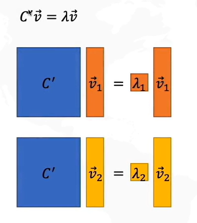
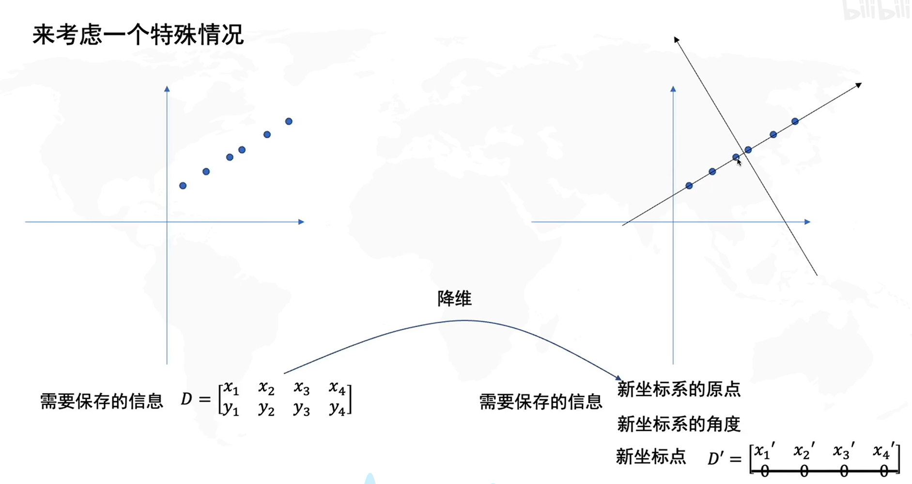
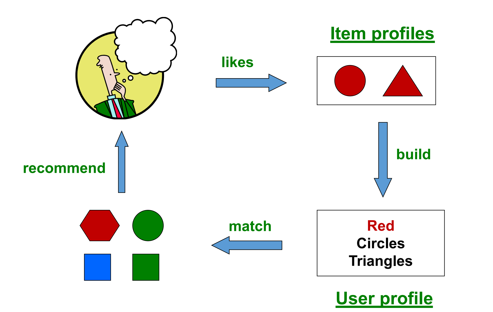

# 机器学习

## 一、评判标准

### 准确度、召回率的定义

**准确度的定义**

准确度是分类器**正确分类的样本数占总样本数的比例**，用公式表示为：

$$
\text{Accuracy} = \frac{TP + TN}{TP + TN + FP + FN}
$$
其中：

- TP：真正例

- TN：真负例

- FP：假正例

- FN：假负例

- **TP（真正例）** 和 **TN（真负例）** 都是**预测正确**的结果，但它们的区别在于：

  - **TP（True Positive，真正例）**

    实际是正类（比如患病的人），模型也预测为正类（例如正确地识别为患病）

  - **TN（True Negative，真负例）**

    实际是负类（比如健康的人），模型也预测为负类（正确地识别为没病）
  
- **例题**：假设做疾病检测，某人 **实际有病（正类）**，但模型预测为“健康”（负类）

  - 这属于 **FN（假负例）**，因为模型漏掉了真正的患者

**召回率的定义**

召回率是分类器**正确识别出的正例**占**所有实际正例**的比例，用公式表示为：

$$
\text{Recall} = \frac{TP}{TP + FN}
$$

- ⭐ FN是“被错误地分成了负类的例子”，因此实际上是正例！
- **例题**：假设做疾病检测
  - **实际正类样本有10人（实际患病）**
  - 模型预测中正确识别了 **7个正例（TP = 7）**，但错误地漏掉了 **3个正例（FN = 3）**
  - Recall = $\frac{TP}{TP + FN} = \frac{7}{7 + 3} = 0.7$

### 如何根据表格计算准确率和召回率⭐

- #### ⭐看清楚标签的名字！！！

假设有一个疾病检测模型，以下是检测结果的**混淆矩阵**

| 实际/预测       | 有病 (正类) | 无病 (负类)                |
| --------------- | ----------- | -------------------------- |
| **有病 (正类)** | 50 (TP)     | 10 ($\textcolor{red}{FN}$) |
| **无病 (负类)** | 5 (FP)      | 35 (TN)                    |

**准确率**

- **定义**：准确率是所有预测正确的样本数占总样本数的比例

- 代入数据
  $$
  \text{Accuracy} = \frac{50 + 35}{50 + 35 + 5 + 10} = \frac{85}{100} = 0.85
  $$

**召回率** 

- **定义**：召回率是正确预测的正类样本（真正例）占所有实际正类样本的比例

- 代入数据
  $$
  \text{Recall} = \frac{50}{50 + 10} = \frac{50}{60} = 0.8333
  $$
  

**其他指标计算**

**精确率 (Precision)**

- **正确识别出的正例**占**所有预测为正例**的比例

- 公式为
  $$
  \text{Precision} = \frac{\text{TP}}{\text{TP} + \text{FP}}
  $$
  
- 代入数据
  $$
  \text{Precision} = \frac{50}{50 + 5} = \frac{50}{55} = 0.9091
  $$
  

F1 分数 (F1-score)

- F1 是精确率和召回率的**调和平均**
  $$
  F1 = 2 \cdot \frac{\text{Precision} \cdot \text{Recall}}{\text{Precision} + \text{Recall}}
  $$

- 代入数据
  $$
  F1 = 2 \cdot \frac{0.9091 \cdot 0.8333}{0.9091 + 0.8333} = 2 \cdot \frac{0.7575}{1.7424} \approx 0.8688
  $$

### F评判指标的含义⭐

F评判指标是准确率和召回率的调和平均，用公式表示为：
$$
F_1 = 2 \cdot \frac{\text{Precision} \cdot \text{Recall}}{\text{Precision} + \text{Recall}}
$$
其中，$\text{Precision} = \frac{TP}{TP + FP}$

### P@K怎么计算⭐

P@K 表示前 $K$ 个推荐结果中的相关结果比例，用公式表示为：
$$
P@K = \frac{\text{前K个推荐结果中相关结果的个数}}{K}
$$

**例题**

假设有一个推荐系统，用来推荐商品给用户。系统给出了 10 个推荐结果，用户对其中的一部分商品有兴趣（相关），而其他商品则无兴趣（不相关）

**推荐结果及相关性：**

| 排名 | 推荐商品 | 是否相关 |
| ---- | -------- | -------- |
| 1    | 商品A    | 相关     |
| 2    | 商品B    | 不相关   |
| 3    | 商品C    | 相关     |
| 4    | 商品D    | 不相关   |
| 5    | 商品E    | 相关     |
| 6    | 商品F    | 不相关   |
| 7    | 商品G    | 不相关   |
| 8    | 商品H    | 不相关   |
| 9    | 商品I    | 相关     |
| 10   | 商品J    | 不相关   |

计算 $P@K$ 时，选择 $K$ 个推荐结果，并计算这些结果中相关商品的比例

**计算 P@3**

- 取前 3 个推荐结果：商品A（相关）、商品B、商品C（相关）

- 代入数据
  $$
  P@3 = \frac{2}{3} = 0.6667
  $$

**计算 P@5**

- 取前 5 个推荐结果：商品A（相关）、商品B（相关）、商品C（相关）、商品D（相关）、商品E（相关）

- 代入数据
  $$
  P@5 = \frac{3}{5} = 0.6
  $$

### MAP怎么计算

MAP 是对多个查询的**平均精度** (AP) **求均值**

- 每个查询的 AP 计算公式为：
  $$
  AP = \frac{\sum_{k=1}^N P@k \cdot \text{rel}(k)}{\text{相关结果总数}}
  $$
  其中：

  - P@k：**前** k 个推荐结果的精度
  - $\text{rel}(k)$：**第 k 个**推荐结果是否相关（相关为1，不相关为0）

- MAP 则是多个查询的 AP 的平均值：
  $$
  MAP = \frac{\sum_{q=1}^Q AP(q)}{Q}
  $$
  Q 表示查询总数

**例题**

单个查询的 AP 计算

| **排名** | **推荐商品** | **是否相关 (rel)** | **P@k**                | **累加值：P@k × rel(k)**   |
| -------- | ------------ | ------------------ | ---------------------- | -------------------------- |
| 1        | 商品A        | 1                  | $\frac{1}{1} = 1.0$    | $1.0 \times 1 = 1.0$       |
| 2        | 商品B        | 0                  | $\frac{1}{2} = 0.5$    | $0.5 \times 0 = 0.0$       |
| 3        | 商品C        | 1                  | $\frac{2}{3} = 0.6667$ | $0.6667 \times 1 = 0.6667$ |
| 4        | 商品D        | 0                  | $\frac{2}{4} = 0.5$    | $0.5 \times 0 = 0.0$       |
| 5        | 商品E        | 1                  | $\frac{3}{5} = 0.6$    | $0.6 \times 1 = 0.6$       |
| 6        | 商品F        | 0                  | $\frac{3}{6} = 0.5$    | $0.5 \times 0 = 0.0$       |
| 7        | 商品G        | 0                  | $\frac{3}{7} = 0.4286$ | $0.4286 \times 0 = 0.0$    |
| 8        | 商品H        | 0                  | $\frac{3}{8} = 0.375$  | $0.375 \times 0 = 0.0$     |
| 9        | 商品I        | 1                  | $\frac{4}{9} = 0.4444$ | $0.4444 \times 1 = 0.4444$ |
| 10       | 商品J        | 0                  | $\frac{4}{10} = 0.4$   | $0.4 \times 0 = 0.0$       |

**AP 计算**

1. 计算所有相关结果的 $P@k$ 值（即 $P@k \cdot \text{rel}(k)$ 的累加值）

2. 将累加值除以相关结果总数

   - 累加值：$1.0 + 0.6667 + 0.6 + 0.4444 = 2.7111$
   - 相关结果总数 = 4

3. **AP 计算结果**

   $AP = \frac{2.7111}{4} = 0.6778$

**MAP 计算**

假设这是唯一一个查询，则：

$MAP = AP = 0.6778$

如果有多个查询，则对所有查询的 AP 求平均。例如：

- 查询 1 的 AP = 0.6778
- 查询 2 的 AP = 0.8
- 查询 3 的 AP = 0.6

**MAP 计算：**$MAP = \frac{0.6778 + 0.8 + 0.6}{3} = 0.6926$

### DCG怎么计算

DCG 是一种评价搜索结果排名质量的指标，用公式表示为：
$$
DCG = \sum_{i=1}^N \frac{2^{\text{rel}_i} - 1}{\log_2(i + 1)}
$$
其中：

- $\text{rel}_i$：第 $i$ 个结果的相关性评分
- $i$：结果排名

### NDCG怎么计算

NDCG 是将 DCG 正规化，以使其值在 [0,1] 之间，用公式表示为：
$$
DCG = \frac{DCG}{IDCG}
$$
其中，

- DCG：实际排名的折扣增益
- IDCG：理想排名（相关性从高到低排序）的折扣增益

## 二、线性回归模型

### 1. 目标函数

线性回归模型的目标函数是最小化预测值与实际值之间的误差，通常采用 **均方误差**（MSE）作为损失函数。它表示为：
$$
J(\theta) = \frac{1}{m} \sum_{i=1}^{m} (h_{\theta}(x^{(i)}) - y^{(i)})^2
$$
其中，$h_{\theta}(x^{(i)})$ 是模型预测的值，$y^{(i)}$ 是实际值，$m$ 是样本数量，$\theta$ 是模型参数

### 2. 参数的定义方法是什么

线性回归模型的参数是通过最小化目标函数来求解的。参数通常是通过 **最小二乘法** 或 **梯度下降法** 来估计。具体来说，线性回归的参数包括：

- 权重参数 $\theta_1, \theta_2, ..., \theta_n$，表示每个特征对输出的影响
- 偏置项 $\theta_0$，表示当所有特征值为0时的预测值

### 3. 模型的数值形式是什么

线性回归的模型数值形式是：
$$
h_{\theta}(x) = \theta_0 + \theta_1 x_1 + \theta_2 x_2 + ... + \theta_n x_n
$$
其中，$x_1, x_2, ..., x_n$ 是输入特征，$\theta_0$ 是偏置项，$\theta_1, \theta_2, ..., \theta_n$ 是对应特征的权重参数

### 4. 目标函数的推导

目标函数推导的核心思想是通过优化损失函数（通常是均方误差）来找到最优参数。均方误差损失函数对参数求偏导数，利用最小化损失函数的梯度来更新参数。

- 目标函数为
  $$
  J(\theta) = \frac{1}{2m} \sum_{i=1}^{m} (h_{\theta}(x^{(i)}) - y^{(i)})^2
  $$
  
- 对 $\theta_j$ 求偏导数
  $$
  \frac{\partial J(\theta)}{\partial \theta_j} = \frac{1}{m} \sum_{i=1}^{m} (h_{\theta}(x^{(i)}) - y^{(i)}) x_j^{(i)}
  $$

- 偏导数是目标函数关于参数的变化率，告诉我们应该朝哪个方向调整参数，通过使用梯度下降更新公式不断优化参数 $\theta_j$，**反复计算**目标函数的梯度，并根据梯度的方向更新参数。每次迭代时，参数会朝着梯度的反方向调整，从而逐渐减少损失函数的值，最终收敛到最小值

### 5. 什么是梯度下降⭐

梯度下降是一种优化算法，用于通过不断调整模型参数来**最小化**目标函数

- 其基本思路是沿着目标函数的梯度方向调整参数，以减小损失函数的值

- 梯度下降的更新公式为：
  $$
  \theta_j := \theta_j - \alpha \frac{\partial J(\theta)}{\partial \theta_j}
  $$

其中，$\alpha$ 是学习率，$\frac{\partial J(\theta)}{\partial \theta_j}$ 是损失函数的梯度

### 6. 了解使用梯度下降求解

使用梯度下降法求解线性回归的参数时，我们通过反复计算目标函数的梯度，并根据梯度的方向更新参数

每次迭代时，参数会朝着梯度的反方向调整，从而逐渐减少损失函数的值，最终收敛到最小值

### ⭐学习率对于求解的影响

学习率（$\alpha$）控制每次更新参数时的步长

- 如果学习率过大，参数可能会“跳过”最优解，导致无法收敛
- 如果学习率过小，优化过程会变得非常缓慢，甚至可能在有限的迭代次数内无法找到最优解
- 适当的学习率可以确保梯度下降快速且稳定地收敛到最优解

#### ⭐为什么“减”是求最小值？

因为目标函数是关于参数的一个凸函数（对于线性回归而言）。梯度方向表示目标函数在当前位置的变化趋势，因此沿着梯度的反方向调整参数会让目标函数值减小，逐步接近最小值

### 7. 为什么要进行空间的转换

可以使得数据的分布更加适合线性回归模型

- 例如，使用多项式回归时，通过增加高阶项来扩展特征空间，使得模型能够拟合非线性关系
- 在某些情况下，空间转换（如标准化或归一化）有助于加快优化过程，并使得模型更加稳定
- 转换后的特征可以避免某些特征占主导地位，使得每个特征的影响力更加均衡

### 8. 了解偏置和方差（考试不考推导 知道即可）

- **偏差**：模型预测值与真实值之间的系统性差异，反映了模型的预测能力
  - 如果偏差较大，说明模型过于简单，不能很好地拟合数据
- **方差**：模型对训练数据的敏感度，反映了模型的复杂性
  - 如果方差较大，说明模型对训练数据的噪声过于敏感，可能导致过拟合

在实际应用中，偏差和方差之间存在一个权衡

理想的模型应该有较低的偏差和较低的方差，即能够很好地拟合数据，并具有较强的泛化能力

## 三、逻辑回归⭐⭐

### 1. 目标函数的定义⭐

逻辑回归的目标函数是**对数似然函数**

- 假设我们有一组训练数据$(x_1, y_1), (x_2, y_2), ..., (x_n, y_n)$，其中 $x_i$​ 是特征向量，$y_i$​ 是类别标签，取值为0或1

- 逻辑回归模型的输出是通过一个sigmoid函数（逻辑函数）映射到 $[0, 1]$ 之间的概率值，定义为：
  $$
  h_\theta(x) = \frac{1}{1 + e^{-\theta^T x}}
  $$

- 目标函数是**最大化**训练数据的对数似然函数，它可以表示为：
  $$
  J(\theta) = - \frac{1}{m} \sum_{i=1}^{m} \left[ y_i \log(h_\theta(x_i)) + (1 - y_i) \log(1 - h_\theta(x_i)) \right]
  $$
  其中 $m$ 是样本数量，$\theta$ 是模型的参数向量，我们通过**最大化**这个目标函数来找到最优的 $\theta$

### 2. 为什么叫做逻辑回归？与线性回归的区别⭐

“逻辑回归”这个名字源于其使用的**逻辑函数（sigmoid函数）**，它将线性回归的输出映射到 $[0,1]$ 之间，适合用于二分类问题

- **线性回归**：目标是预测**连续**的数值，使用线性方程形式来建立输入特征与输出之间的关系。线性回归模型为：
  $$
  y = \theta^T x + \epsilon
  $$
  其中 $y$ 是预测值，$\theta$ 是模型参数，$x$ 是特征向量

- **逻辑回归**：目标是预测**二分类**的概率，使用sigmoid函数对线性回归的输出进行转换，以得到预测属于类别1的概率。其模型形式为：
  $$
  P(y = 1|x) = \frac{1}{1 + e^{-\theta^T x}}
  $$
  这使得逻辑回归的输出介于0到1之间，适合进行分类任务

### 3. 求偏导的方式

在逻辑回归中，需要通过梯度下降法来优化目标函数

- 为了实现这一点，首先计算目标函数 $J(\theta)$ 对参数 $\theta$ 的偏导数。对每个参数 $\theta_j$，其偏导数为：
  $$
  \frac{\partial J(\theta)}{\partial \theta_j} = \frac{1}{m} \sum_{i=1}^{m} (h_\theta(x_i) - y_i) x_{ij}
  $$
  其中，$h_\theta(x_i)$ 是对输入 $x_i$ 的预测输出，$x_{ij}$ 是第 $i$ 个样本的第 $j$ 个特征

- 该偏导数表示了模型预测值与真实标签之间的误差对模型参数的影响

### 4. 如何更新参数⭐

通过计算出每个参数的偏导数，可以使用梯度下降法来更新参数。更新规则如下：
$$
\theta_j := \theta_j - \alpha \frac{\partial J(\theta)}{\partial \theta_j}
$$
其中 $\alpha$ 是学习率，决定了每次更新的步长。重复这个过程直到目标函数收敛

### 5. 为什么要进行正则化？⭐

正则化的目的是防止**过拟合**。过拟合发生在模型过于复杂，捕捉到训练数据中的噪声或不真实的模式，从而导致模型在新数据上的表现变差。通过在目标函数中加入正则化项，我们可以惩罚模型的复杂度，避免模型参数过大，从而提高模型的泛化能力

- **L1正则化**：加入 $\frac{\lambda}{m} \sum_{j=1}^n |\theta_j|$，这种正则化可以导致稀疏解，即某些参数变为零

- **L2正则化**：在目标函数中加入 $\frac{\lambda}{2m} \sum_{j=1}^n \theta_j^2$，其中 $\lambda$ 是正则化强度的超参数，控制正则化项的影响

正则化项限制了模型的复杂度，帮助提升其在未见数据上的表现。

## 四、决策树

### 1. 给定一个数据集，如何构造决策树

- **选择最优特征**：选择一个特征来分割数据集，通常通过计算**信息增益**、**基尼指数**等指标来选择最优特征
- **分割数据集**：根据选择的特征将数据集分割成若干个子集，每个子集中的数据点具有相同的特征值
- **递归构建**：对每个子集重复上述过程，直到满足停止条件（如数据集纯度达到最大，或者没有更多特征可用）
- **生成叶节点**：当数据集无法进一步分割时，将该节点作为叶节点，分配一个类别标签

### 2. 决策树解决的任务（分类）

决策树主要用于分类任务，其通过分割特征空间来进行类别预测

- 给定一个输入实例，决策树通过路径上的决策规则（基于特征值）最终到达一个叶节点，叶节点的类别标签就是该实例的预测结果

### 3. 决策树的基本思路

决策树的基本思路是通过一系列的决策规则（基于特征的条件）将数据划分成不同的类别

- 每个决策节点通过特征值将数据集分割，直到最终得到一个纯净的子集，每个子集中的所有实例都属于同一类别

### 4. 信息增益怎么计算

信息增益是决策树中用于选择分割特征的一个指标。它衡量的是通过选择一个特征进行分割后，数据集的不确定性减少的程度。

信息增益的计算公式为：
$$
\text{信息增益}(S, A) = \text{熵}(S) - \sum_{v \in \text{values}(A)} \frac{|S_v|}{|S|} \cdot \text{熵}(S_v)
$$
其中：

- $S$ 是数据集，$A$ 是特征，$S_v$ 是特征 $A$ 在取值 $v$ 下的子集
- $\text{熵}(S)$ 是数据集 $S$ 的熵，表示数据的不确定性
- $\text{熵}(S_v)$ 是数据集 $S_v$ 的熵，表示按特征 $A$ 分割后的子集的不确定性

⭐⭐**信息增益最大化**：通过计算每个特征的**信息增益**，选择信息增益最大的特征作为当前节点的分裂依据

### 5. 基尼值和基尼指数是什么，怎么算

- **基尼值**：基尼值是一种用于决策树分割数据集纯度的指标。它衡量的是从数据集中随机选择一个样本时，该样本被错误分类的概率。

  基尼值的计算公式为：
  $$
  \text{基尼值}(S) = 1 - \sum_{i=1}^k p_i^2
  $$
  其中 $p_i$ 是类别 $i$ 在数据集 $S$ 中的比例，$k$ 是类别的总数

- **基尼指数**：在决策树中使用时，基尼指数是基尼值的扩展，用来衡量特征选择的优劣，通常用来替代信息增益来选择分裂节点。它是每次分割后基尼值的加权平均

  - 我们选择基尼指数**最小化**的特征进行分裂，因为基尼指数越小，节点的纯度越高

### 6. 信息熵和条件熵是怎么定义的

- **信息熵**：信息熵衡量的是数据集的纯度或不确定性，越大表示越不确定，越小表示越纯净。定义为：
  $$
  \text{熵}(S) = - \sum_{i=1}^k p_i \log_2 p_i
  $$
  其中 $p_i$ 是数据集 $S$ 中第 $i$ 类的概率

- **条件熵**：条件熵是给定某个特征的情况下，数据集的不确定性。假设特征 $A$ 取值为 $v$，则条件熵的定义为：
  $$
  H(S | A) = \sum_{v \in \text{values}(A)} \frac{|S_v|}{|S|} \cdot \text{熵}(S_v)
  $$
  其中 $S_v$ 是特征 $A$ 取值为 $v$ 时的数据子集
  
- **信息熵**：选择信息熵**最小化**的特征进行分裂，因为信息熵越小，节点的纯度越高

### 7. 增益率是怎么算的

增益率是对信息增益的改进，考虑到信息增益偏向选择具有较多取值的特征，增益率通过对特征的“固有熵”进行规范化来解决这个问题

增益率的计算公式为：
$$
\text{增益率}(S, A) = \frac{\text{信息增益}(S, A)}{\text{固有熵}(A)}
$$
其中固有熵的计算为：
$$
\text{固有熵}(A) = - \sum_{v \in \text{values}(A)} \frac{|S_v|}{|S|} \log_2 \frac{|S_v|}{|S|}
$$

### 8. 为什么要提出增益率

增益率的提出是为了克服信息增益的偏差。信息增益倾向于选择取值较多的特征，而这些特征可能并不一定是最优的。增益率通过引入“固有熵”这一项，减少了这一偏差，使得特征的选择更加合理

### 9. 预剪枝和后剪枝是什么（思想）

**预剪枝**

在构建决策树的过程中**提前限制**树的生长

- 当树的某个节点分裂时，如果分裂后没有显著的改善模型的预测性能，就会停止分裂
- 这种方法的核心思想是在树的构建过程中“提前停止”生长，**避免**生成过于**复杂的树结构**
- **常见的预剪枝策略**
  - 限制树的最大深度
  - 设置最小样本数，只有当某个节点的样本数大于某个阈值时，才会继续分裂
  - 限制每个叶子节点最小样本数，避免过多的分支导致过拟合

**后剪枝**

- 在决策树完全构建之后，再对树进行修剪
- 修剪的目标是通过删除某些不必要的节点，来减少过拟合
- 后剪枝会通过评估删除某个节点后的模型性能，决定是否删除该节点
- **常见的后剪枝策略**
  - 利用交叉验证评估子树的表现，如果子树的性能较差，就剪枝该子树
  - 比较当前节点的分裂和不分裂的模型性能，如果不分裂的模型更好，就将当前节点剪枝

**总结**

- **预剪枝**是在构建决策树的过程中通过设置规则限制树的生长，**避免过拟合**
- **后剪枝**是在树构建完成后通过修剪多余的节点来提高模型的泛化能力

## 五、支持向量机SVM

### 1. 支持向量机的目标 

支持向量机的目标是通过找到一个**超平面**，将**不同类别的数据点分开**，并且使得**两个类别之间的间隔最大化**

- 这种**最大间隔的分类能够提高模型的泛化能力**

  - 可以确保即使在存在噪声的情况下，分类器依然能够做出正确的预测
  - 如果超平面靠近任何一类数据点，模型可能会更容易受到局部扰动（如噪声或小的偏差）的影响，进而过拟合训练数据

- 超平面用于在高维空间中分隔不同类别数据点

  - 低维空间中的超平面

    - 在二维空间中，超平面就是一条直线。例如，对于一个二维空间中的数据点 $(x_1, x_2)$，可以用方程 $ax_1 + bx_2 + c = 0$ 表示一个超平面。它将平面分割成两个部分，每一部分包含一个类别的数据点
    - 在三维空间中，超平面是一个平面，表示为方程 $ax_1 + bx_2 + cx_3 + d = 0$

  - 高维空间中的超平面

    - 在更高维的空间中，超平面是一个比数据点维度少1的空间
      - 例如，若数据点是 n-维的，那么超平面就是一个 $(n-1)$-维的空间
    - 超平面同样可以用一个**线性方程**来表示，如 $w_1 x_1 + w_2 x_2 + \dots + w_n x_n + b = 0$，其中 $w_1, w_2, \dots, w_n$ 是超平面的**法向量**，$b$ 是偏置项

  - 超平面的几何意义

    超平面的几何意义是它能够分割数据空间，且其法向量 $\mathbf{w} = (w_1, w_2, \dots, w_n)$ 描述了超平面的方向。⭐**法向量的大小决定了超平面与数据点之间的距离关系**

  

### 2. 支持向量机的基本思想

支持向量机的基本思想是通过寻找一个最优超平面（即决策边界），将数据分为不同的类别。该超平面最大化了不同类别数据点之间的间隔，从而提升了分类的稳定性和鲁棒性

- 对于线性可分的情况，SVM试图找到一个超平面，将正类和负类分开，并且最大化这个超平面与数据点之间的间隔
- 对于非线性可分的情况，SVM通过引入核函数，将数据映射到高维空间，在该空间中进行线性分割

### 3. 如何计算出来点到给定线的距离

在二维空间中，给定直线 $ax + by + c = 0$ 和点 $(x_0, y_0)$，点到直线的（最短）距离公式为：
$$
d = \frac{|ax_0 + by_0 + c|}{\sqrt{a^2 + b^2}}
$$

### 4. 支持向量机的目标函数

支持向量机的目标是**最大化间隔**，同时确保**每个数据点正确分类**。目标函数可以表示为**最小化**以下目标函数：
$$
\min_{\mathbf{w}, b} \frac{1}{2} \|\mathbf{w}\|^2
$$
这个目标函数的含义是：

1. **最小化 $\frac{1}{2} \|\mathbf{w}\|^2$**

   - $\mathbf{w}$ 是超平面的法向量，法向量的大小（即 $\|\mathbf{w}\|$）决定了分类间隔的大小

   - 我们希望通过最小化 $\|\mathbf{w}\|$ 来**最大化**两类数据点之间的间隔，因为超平面与两类数据点的距离（间隔）是 $\frac{1}{\|\mathbf{w}\|}$

     - 对于任意一个数据点 $\mathbf{x}_i$，其到超平面的距离 $d_i$ 可以通过以下公式计算：
       $$
       d_i = \frac{|\mathbf{w} \cdot \mathbf{x}_i + b|}{\|\mathbf{w}\|}
       $$

       - $\mathbf{w} \cdot \mathbf{x}_i + b$ 是点 $\mathbf{x}_i$ 在超平面法向量方向上的投影值
       - $\|\mathbf{w}\|$ 是超平面的法向量的长度

2. **间隔最大化**

   - 最大化间隔（即尽可能让超平面远离两类数据点）是支持向量机的核心目标

   - 间隔的大小与 $\|\mathbf{w}\|$ 成反比，因此，最小化 $\|\mathbf{w}\|^2$ 就等于最大化分类的间隔

3. **b 的作用**：偏置项 $b$ 不直接出现在目标函数中，而是通过约束条件来处理，确保数据点正确分类

约束条件是每个数据点都被正确分类：
$$
y_i (\textcolor{red}{\mathbf{w}} \cdot \mathbf{x}_i + b) \geq 1 \quad \forall i
$$
这里，$\textcolor{red}{\mathbf{w}}$ 是超平面的法向量，$b$ 是偏置，$\mathbf{x}_i$ 是数据的特征向量，$y_i$ 是数据点的标签

1. **确保数据点正确分类**

   - $y_i$ 是数据点 $\mathbf{x}_i$ 的标签，取值为 +1 或 -1
   - $\mathbf{w} \cdot \mathbf{x}_i + b$ 是超平面上对于数据点 $\mathbf{x}_i$ 的预测值
     - 这个值越大（对于正类而言），模型就越确定 $\mathbf{x}_i$ 属于正类
     - 这个值越小（对于负类而言），模型就越确定 $\mathbf{x}_i$ 属于负类
   - 对于每个数据点  $\mathbf{x}_i$，我们希望 $y_i (\mathbf{w} \cdot \mathbf{x}_i + b) \geq 1$，这意味着：
     - 如果 $y_i = 1$（正类），则 $\mathbf{w} \cdot \mathbf{x}_i + b \geq 1$，确保正类数据点位于超平面的一侧，并且与超平面有一定的间隔
     - 如果 $y_i = -1$（负类），则 $\mathbf{w} \cdot \mathbf{x}_i + b \leq -1$，确保负类数据点位于超平面的另一侧，并且也有一定的间隔

2. **确保每个数据点的正确分类**

   这个约束条件确保了所有的训练数据点都能被正确地分类到超平面的两侧，并且保证数据点和超平面之间的距离至少为 1

3. 对于支持向量（即距离超平面最近的点），这个距离刚好是 1

### 5. 如何求解目标函数

1. **定义优化问题**

   - 支持向量机的目标是最大化分类间隔，而目标函数可以通过最小化 $\frac{1}{2} \|\mathbf{w}\|^2$ 来实现间隔的最大化

   - 同时，所有的训练数据点需要满足分类正确的约束条件：
     $$
     y_i (\mathbf{w} \cdot \mathbf{x}_i + b) \geq 1 \quad \forall i
     $$
     这里，$\mathbf{w}$ 是超平面的法向量，$b$ 是偏置，$\mathbf{x}_i$ 是数据的特征向量，$y_i$ 是数据点的标签

2. **构建拉格朗日函数**

   - 由于有约束条件，优化问题是一个约束优化问题

   - 为了求解带约束的优化问题，常常使用 **拉格朗日乘数法**

   - 拉格朗日函数 $\mathcal{L}$ 将目标函数与约束条件结合起来，形式如下：
     $$
     \mathcal{L}(\mathbf{w}, b, \lambda) = \frac{1}{2} \|\mathbf{w}\|^2 - \sum_{i=1}^N \lambda_i \left( y_i (\mathbf{w} \cdot \mathbf{x}_i + b) - 1 \right)
     $$
     其中，$\lambda_i$ 是拉格朗日乘数，表示约束条件的“权重”

3. **求解拉格朗日对偶问题**

   为了使优化问题更易于求解，通常将原始问题转化为 **对偶问题**。对偶问题可以通过对拉格朗日函数进行偏导数并令其为零来得到：

   - 对 $\mathbf{w}$ 和 $b$ 求偏导数，并令其为零，得到关于 $\mathbf{w}$ 和 $b$ 的解
   - 得到对偶形式的优化问题，其中目标函数通常与拉格朗日乘数 $\lambda_i$ 有关，约束条件则是 $\lambda_i \geq 0$ 和 $\sum \lambda_i y_i = 0$

4. **求解优化问题**

   对偶问题求解后，得到的最优解可以用来计算超平面法向量 $\mathbf{w}$ 和偏置项 $b$：

   - $\mathbf{w} = \sum_{i=1}^N \lambda_i y_i \mathbf{x}_i$
   - $b$ 的计算可以通过支持向量点的条件来确定：对于支持向量（即距离超平面最近的点），其满足 $y_i (\mathbf{w} \cdot \mathbf{x}_i + b) = 1$

5. **利用优化结果进行分类**

   一旦获得了 $\mathbf{w}$ 和 $b$，可以利用超平面来对新数据点进行分类。分类规则是：
   $$
   \text{sign}(\mathbf{w} \cdot \mathbf{x} + b)
   $$
   如果结果为正，则属于正类；如果为负，则属于负类

6. ### ⭐总结

   1. **构建优化问题**，定义目标函数 $\frac{1}{2} \|\mathbf{w}\|^2$ 和约束条件 $y_i (\mathbf{w} \cdot \mathbf{x}_i + b) \geq 1$
   2. **应用拉格朗日乘数法**，构建拉格朗日函数，并得到对偶问题
   3. **求解对偶问题**，得到拉格朗日乘数 $\lambda_i$
   4. **计算超平面参数** $\mathbf{w}$ 和 $b$
   5. **使用得到的超平面进行分类**

### 6. 如何用拉格朗日求解目标函数（拉格朗日乘数）

使用拉格朗日乘数法求解SVM目标函数时，首先构造拉格朗日函数：
$$
\mathcal{L}(\mathbf{w}, b, \lambda) = \frac{1}{2} \|\mathbf{w}\|^2 - \sum_{i=1}^{N} \lambda_i \left( y_i (\mathbf{w} \cdot \mathbf{x}_i + b) - 1 \right)
$$
然后，对拉格朗日函数分别对 $\mathbf{w}$, $b$ 和 $\lambda_i$ 求偏导数，并设置为零，得到一组方程，通过这些方程来求解最优的 $\mathbf{w}$ 和 $b$

### 7. 什么叫作支持向量

支持向量是**决定决策边界**的关键点，也是距离分类超平面（决策边界）**最近**的那些数据点，它们对超平面的定位起着决定性作用

- 这些支持向量的存在确保了分类的**间隔最大化**
- 换句话说，支持向量帮助我们找到一个最优的超平面，使得超平面能尽可能地远离所有数据点，从而提高模型的泛化能力
- 特点
  - **支持向量是分类边界上的点**：它们位于超平面附近，甚至可能恰好位于边界上
  - **它们对超平面的定位至关重要**：其他数据点即使被移除，也不会影响到分类结果，而支持向量是构造超平面的核心
  - **它们是最难分类的数据点**：因为它们最接近决策边界，所以它们通常是分类过程中最难分的点

### 8. 支持向量的作用

支持向量的作用是决定最优超平面的方程

- 它们是距离超平面最近的样本点，它们的存在确保了SVM分类的准确性和有效性
- 移除支持向量将改变决策边界，而移除其他非支持向量的点则不会影响模型

### 9. 支持向量机的优点和缺点

- **优点**
  - 对高维数据有良好的处理能力
  - 在样本较少的情况下仍能有效进行分类
  - 具有**较好的泛化能力**⭐⭐
- **缺点**
  - 对参数和核函数的**选择**比较**敏感**
  - 在大规模数据集上训练较**慢**
  - 对噪声数据较为**敏感**

### 10. 核函数的功能

核函数的主要功能是将数据从原始空间映射到高维空间，以便在高维空间中进行线性分割

- 通过使用核函数，SVM可以**处理非线性可分的数据**，并使得数据点在更高维的空间中变得线性可分

### 11. 核函数的种类及其功能（如高斯核函数）

常见的核函数包括：

- **线性核函数**：当数据本身是线性可分时，使用线性核函数 $K(x, y) = x^T y$

- **高斯径向基核函数**：通过高斯函数来映射数据，通常用于非线性分类
  - 高斯核可以将数据映射到无限维的空间，使得非线性数据也可以在高维空间中进行线性分割
  
- **多项式核函数**：通过多项式函数将数据映射到更高的维度

### 12. 引入核函数的原因

引入核函数的原因是为了能够**处理非线性可分**的数据

- 直接在原始空间中构造超平面可能无法有效分割数据，核函数通过“核技巧”将数据**映射到更高维空间**后，可能会变得线性可分
- 通过核函数，SVM可以高效地计算数据点在高维空间的内积，而无需显式地进行高维映射（即核技巧，这是对核技巧的具体描述），从而在保证高效性的同时实现复杂数据的分类

## 六、KNN

### 1. **KNN 是用来做什么任务的？**

KNN（**K-Nearest Neighbors**）是一种**监督学习算法**，主要用于**分类**和**回归**任务

其基本思想是：通过计算样本之间的距离，找出一个数据点最相似的 K 个邻居，然后通过邻居的标签或值来预测该数据点的标签或数值

- **分类任务**：在分类问题中，KNN 通过计算待预测数据点与训练集中所有样本的距离，选择最近的 K 个样本。然后根据这些邻居所属的类别，进行**投票选择**最常见的类别作为预测结果
- **回归任务**：在回归问题中，KNN 根据 K 个邻居的**目标值的平均值**来预测目标变量

### 2. **KNN 的优缺点**

**优点**

- **简单易懂**：KNN 是一种非常直观且易于理解的算法，原理简单，容易实现
- **无需训练阶段**：KNN 是一种基于实例的学习算法，不需要通过复杂的训练过程来构建模型，只需存储训练数据，预测时直接进行计算
- **适用于多类别问题**：KNN 能够处理多类别分类任务，不需要假设类别之间的关系或分布
- **灵活性强**：可以通过调整 K 值、选择不同的距离度量（如欧几里得距离、曼哈顿距离等）来调整模型的表现

**缺点**：

- **计算量大**：KNN 的预测过程需要计算待预测点与所有训练数据点的距离，因此在数据量较大时，计算开销很大，预测速度较慢
- **高维数据的表现不佳**：KNN 在处理**高维数据**时容易受到“维度灾难”的影响，数据维度越高，距离度量的有效性越低，影响预测准确度
- **对噪声敏感**：KNN 会受到数据中噪声的影响，尤其是当 K 值较小或数据不均衡时，噪声点可能影响最终的预测结果
- **存储要求高**：KNN 需要存储所有的训练数据，在内存和存储空间上可能会有较高的需求

### 3. **KNN 的敏感度**

KNN 算法对以下几个因素较为敏感：

- **K 值的选择**
  - **小 K 值**（如 K=1）会导致模型对噪声敏感，容易发生过拟合，因为它会将某个数据点的噪声作为预测依据
  - **大 K 值**会使得模型变得更加稳定，但也可能导致欠拟合，因为它会**“平滑”掉一些有意义的差异**，使得预测结果趋于简单化
- **距离度量的选择**
  - KNN 对距离度量非常敏感，不同的距离度量（如欧几里得距离、曼哈顿距离等）会影响预测结果
  - 特别是对于高维数据，某些距离度量可能不适合，导致结果不准确
- **特征缩放**
  - KNN 是基于距离度量来进行预测的，因此特征的缩放（标准化或归一化）会显著影响其性能
  - 如果数据的特征维度差异很大，**未进行缩放**可能会导致**某些特征主导了距离计算**，影响分类或回归结果
- **数据分布的敏感性**
  - KNN 在数据分布较为均匀时表现较好，但如果数据存在不平衡（例如类别不均衡或某些类别的数据过少），KNN 可能会对频繁出现的类别进行偏向，影响预测精度

## 七、集成学习

### 1. 集成学习的动机

集成学习的动机主要是通过组合多个模型（通常称为“基学习器”）来提高预测性能

- 单一模型可能受到过拟合或欠拟合的影响，而通过集成多个模型的预测结果，能够降低模型的方或偏差，从而提升模型的泛化能力
- 集成学习的目标是通过综合多个弱分类器来得到一个强分类器（即集成学习的预测效果优于单一模型）
- 常见的动机包括
  - **减少过拟合（在训练集上表现良好，但泛化能力差）**
  - **提升模型的稳定性和鲁棒性**，尤其是在数据集噪声较多的情况下
  - **提高准确性**，通过组合不同模型的优点，得到更好的整体效果

### 2. 集成学习的经典算法

#### 2.1 Bagging算法

Bagging是一种集成学习方法，通过从原始训练数据集中**随机有放回地抽取多个子集**，然后对每个子集训练一个独立的基学习器，最后将这些基学习器的预测结果进行组合（通常是**投票或平均**）

- 优点
  - 减少过拟合：通过多次采样和组合，Bagging可以显著**降低模型的方差**，特别适用于高方差模型（如决策树）
  - 并行化：训练多个弱学习器可以并行完成，提升效率
  - 通过组合多个基学习器，Bagging可以使得最终的模型更稳定且准确
- 步骤
  - 从原始数据中使用有放回的抽样方法生成多个不同的训练集
  - 在每个训练集上训练一个基学习器
  - 对所有基学习器的预测进行组合（例如，对于分类问题，使用投票法；对于回归问题，使用平均法）

#### 2.2 Boosting算法

Boosting是一种逐步加权的集成学习方法，通过每次训练一个新的基学习器来**纠正前一个**模型的错误预测

- Boosting会将更多的权重赋给那些被前一模型错误分类的样本，**迫使后续模型更关注这些难以分类的样本**
- 与Bagging不同，Boosting的学习器**之间是依赖的**，通常以加权的方式组合最终的结果
- 步骤
  - 初始化所有样本的权重，通常初始化为均匀权重
  - 对每一轮，训练一个新的基学习器，并根据上一轮学习器的错误进行样本权重更新
  - 将新的基学习器与现有学习器加权组合，最终通过加权投票（分类问题）或加权平均（回归问题）得出最终的预测

### 3. 无监督聚类的集成学习的基本思想

无监督聚类的集成学习主要是将多个聚类算法的结果进行整合，从而提高聚类结果的稳定性和准确性

- 与监督学习的集成学习不同，无监督学习**没有明确的目标标签**，因此集成学习方法**需要在多个不同的聚类算法中组合结果**。基本思想包括：
  - **多模型融合**：使用不同的聚类算法对数据进行聚类，得到多个不同的聚类结果
  - **聚类结果融合**：将多个聚类算法的结果进行融合，常见的融合方法包括投票法、加权投票法或基于聚类质量指标的融合方法
  - **减少聚类的不稳定性**：不同的聚类算法可能会对数据集的不同特性产生不同的聚类效果，通过集成学习，能够减少单一聚类算法对数据的过度拟合，提供更加稳定和可靠的聚类结果

## 八、PCA 主成分分析

### 1. PCA 的目的是什么？

PCA（**主成分分析**）的目的是通过降维**提取数据中的主要信息**，同时尽可能减少信息的丢失

具体来说，它通过寻找原始数据的低维表示来：

1. 消除冗余（去相关性），**提取出主要特征**
2. 降低数据维度以**减少计算复杂度**
3. **去除噪声**，提升模型的鲁棒性
4. 帮助**可视化**高维数据

### 2. PCA 的假设是什么？

1. 数据是**线性可分**的，即数据的主要模式可以通过线性组合来捕捉
2. **主要信息体现在数据的方差中**，方差大的方向携带更多有意义的信息
3. 数据中的特征是均值为零的（通过中心化处理达到），以便方向的方差可以衡量信息量

### 3. PCA 的目标是什么？（对应的最优化问题的理解）⭐⭐

PCA的目标是将高维数据投影到低维子空间，使得投影后的数据方差最大化，同时保留尽可能多的原始信息

对应的最优化问题是：
$$
\text{maximize } \text{Var}(Y) \quad \\\text{subject to} \quad \|w_i\| = 1
$$
其中，

- $Y = XW$ 是投影后的数据
- $W$ 是投影矩阵
- $Var(Y)$ 表示 $Y$ 的方差

- maximize​ 一般用于完整的优化问题，强调过程

  - **maximize** 相当于一个问题的命令，比如“找到最高的山峰”
  - **max** 是问题的答案，比如“最高的山峰是珠穆朗玛峰，高度是 8848 米”
  - **min** 是问题的另一个答案，比如“最低的山谷是死海，海拔是 -430 米”

- 约束 $\|w\| = 1$ 的实际意义

  - 为了让向量 $w$ 的方向决定特征，而不受长度影响

  - 通过归一化，可以将向量 $w$ 变为一个标准化的向量（单位长度向量）

通过计算数据的协方差矩阵 $\Sigma$，PCA通过求解特征值问题：
$$
\Sigma w = \lambda w
$$
**选择最大特征值对应的特征向量作为主成分**，从而实现方差最大化

### 4. PCA 的推导一定要了解清楚！

**推导步骤**

1. **数据中心化**

   - 为了确保PCA提取的是**方差**而不是均值偏差，通常会对数据进行中心化处理

   - 中心化的步骤是将每个特征的均值减去，即：
     $$
     X' = X - \mu
     $$
     其中，$X$ 是原始数据矩阵，$\mu$ 是每列特征的均值

2. **计算协方差矩阵**

   - 协方差矩阵描述了各个特征之间的相关性。对于一个数据矩阵 $X'$，其协方差矩阵 $\Sigma$ 定义为：
     $$
     \Sigma = \frac{1}{n-1} X'^\top X'
     $$
     其中，$n$ 是样本数，$X'^\top$ 是 $X′$ 的转置

   - 协方差矩阵是一个对称矩阵，其中每个元素 $\Sigma_{ij}$ 表示第 $i$ 个特征和第 $j$ 个特征之间的协方差

3. **特征值分解**

   - PCA的核心思想是找到数据中方差最大的方向

   - 为了实现这一点，需要对协方差矩阵进行**特征值分解**，得到特征值和特征向量

   - 协方差矩阵 $\Sigma$ 的特征值分解形式为：
     $$
     \Sigma v = \lambda v
     $$
     其中，$v$ 是协方差矩阵 $\Sigma$ 的特征向量，$\lambda$ 是对应的特征值

     - 特征值 $\lambda$ 代表数据在该特征向量方向上的方差
     - 特征向量 $v$ 是数据变换后的新基向量

     

4. **选择主成分**

   - 通过特征值分解，可以得到所有特征向量 $v$ 和对应的特征值 $\lambda$
   - 特征值 $\lambda$ 越大，意味着该方向上的**方差越大**，**包含的信息越多**。因此，选择对应最大特征值 $\lambda$ 的特征向量 $v$ 作为主成分
   - 假设我们选择前 $k$ 个最大的特征值对应的特征向量，这些特征向量构成了新的基空间。将原始数据投影到这些主成分上，就得到了降维后的数据

5. **数据投影**

   - 最后，得到的主成分构成了一个新的正交基，数据可以通过以下公式投影到该基上：
     $$
     Y = X' V_k
     $$
     其中，$V_k$ 是包含前 $k$ 个**特征向量的矩阵**，$Y$ 是降维后的数据
     
   - 必须要投影！不然还是多个坐标表示就没有降维的意义了
   
     

### 5. 最小化误差的推导方式

**最小化重构误差**的目标是通过选择主成分（投影方向），使得数据在低维空间中的投影**能够尽量重建原始数据**。这个过程对应于最小化投影误差

假设有数据矩阵 $X \in \mathbb{R}^{n \times d}$，每一行是一个样本，每一列是一个特征

- 要将数据投影到一个低维子空间，并尽量保留信息

- **数据重构误差**

  假设通过矩阵 $W \in \mathbb{R}^{d \times k}$ 将原始数据 $X$ 投影到低维空间 $Y = XW$ 中，接着希望通过投影后的数据 $Y$ 重建原始数据 $X$

- 最小化误差的目标是：
  $$
  \min_W \| X - XW(W^\top W)^{-1}W^\top \|_F^2
  $$
  希望找到一个投影矩阵 $W$，使得重构误差最小

- **推导过程**

  由于重构误差等于数据在主成分方向上的残差，最优化问题最终转化为协方差矩阵的特征值分解。即，寻找最大方差方向等价于最小化投影误差

### 6. 最大化方差的推导方式⭐⭐

**目标**： 找到一个方向，使得投影后的数据方差最大

**数学表达**：
$$
\max \ \text{Var}(\mathbf{w}^T \mathbf{X}) \\ \text{subject to } \|\mathbf{w}\| = 1
$$
**推导**

1. **数据的协方差矩阵**

   - 对数据矩阵 $X$ 进行中心化处理，得到中心化后的矩阵 $X' = X - \mu$，其中 $\mu$ 是每列特征的均值

   - 然后，计算数据的协方差矩阵：
     $$
     \Sigma = \frac{1}{n-1} X'^\top X'
     $$

2. **方差最大化问题**

   PCA的核心目标是找到一个投影矩阵 $W$，使得数据在该子空间中的方差最大化。即：
   $$
   \max_W \text{tr}(W^\top \Sigma W)
   $$
   其中，协方差矩阵 $\Sigma$ 表示数据的分布

3. **推导特征值问题**

   通过对上述目标函数求导，并考虑投影矩阵 $W$ 的正交约束（即 $W^\top W = I$），得到特征值问题：
   $$
   \Sigma w = \lambda w
   $$
   其中，$\lambda$ 是特征值，表示方差的大小，$w$ 是对应的特征向量，表示投影的方向。最大特征值对应着最大方差的方向，选择这些特征向量构成投影矩阵 $W$

   

### 7. PCA 的一些应用和缺陷

**应用**

1. 数据降维：在图像处理、文本处理中用于减少特征维度
2. 数据可视化：高维数据降至2维或3维以便可视化
3. 去噪：过滤掉低方差的特征（假设它们主要是噪声）
4. 数据压缩：减少存储空间需求

**缺陷**

1. **线性假设**：PCA是**基于线性假设**的降维方法，因此无法有效处理数据中的非线性特征组合
2. **方差假设**：PCA **假设方差能表示数据的重要信息**，但在某些情况下可能并非如此
3. **特征缩放敏感**：PCA对不同尺度的特征非常敏感，需要先对数据进行标准化
4. **缺乏可解释性**：主成分是线性组合，可能不具备实际意义，难以解释
5. **对噪声敏感**：PCA可能将噪声较大的方向当作主成分

### 补充

#### 动机

- 高维数据问题
  - 现实世界的数据通常具有很高的维度（如图像数据），**直接处理**会导致计算**复杂度高、模型性能下降**
  - 高维数据通常存在于低维的内在空间中。例如，三维数据可能近似分布在二维平面上
- 降维的重要性
  - 降维可以显著减少数据复杂度，并提取出最重要的信息
  - 举例：人脸图像可以用少量特征值表示

#### 高维数据的本质

- 高维数据往往近似分布在一个低维的内在空间上
  - 三维数据可能近似分布在一个二维平面上
  - 二维数据可能近似分布在一条一维直线上
- **关键问题**：找到数据的**主方向**，以显著降低数据的维度

## 九、EM算法

### 1. EM 算法是什么

EM 算法是一种常用的用于**带有隐变量**的概率模型的参数估计算法

- EM算法是一种用于含有**隐变量**或者**缺失数据**的**最大似然估计**的方法

- 适用于那些**直接观测数据不可获得**的模型，而是通过**隐含的变量来推断模型的参数**
- 该算法通过迭代的方式，逐步优化模型的参数，直至收敛

### 2. EM 算法的参数

- **观察变量**：可以直接观察或获取的数据
  - 通常，观察变量由 $X$ 表示
  - 例如，在聚类问题中，观察变量就是每个数据点的特征
- **隐变量**：不能直接观测的数据
  - 隐变量通常代表了数据**生成过程中的一些未观察到的因素**
  - 在高斯混合模型（GMM）中，隐变量通常表示每个数据点属于哪个高斯分布的类别
- **模型参数**：希望通过 EM 算法进行估计的参数
  - 对于高斯混合模型而言，模型参数包括各高斯分布的均值、方差以及混合系数

### 3. E 步和 M 步分别做什么？

EM 算法的核心思想是通过**迭代优化模型参数**，在每一轮中分别进行 E 步和 M 步：

- **E 步（期望步）**
  - 该步骤的目标是计算在**当前模型参数下**，隐变量的条件期望
  - 简而言之，就是**根据现有的模型参数估计隐变量的分布**
  - 在 E 步中，我们通过当前的参数 $\theta^{(t)}$ 来计算隐变量的后验概率或期望，这通常涉及计算隐变量的分布（或权重）
- **M 步（最大化步）**
  - 在 M 步中，基于 E 步中计算出的隐变量的期望，重新估计模型的参数
  - 目的是通过最大化似然函数，更新模型的参数 $\theta$
  - 具体地，M 步通过最大化似然函数或期望对数似然函数来得到新的参数估计

### 4. EM 算法的推导过程

1. **定义目标函数（对数似然函数）**

   - 首先考虑模型的对数似然函数
   - 目标是最大化对数似然函数 $\log p(X | \theta)$，其中 $X$ 是观察数据，$\theta$ 是模型参数

2. **引入隐变量**

    隐变量 $Z$ 是无法直接观测到的变量，通过将模型的对数似然函数转化为包含隐变量的期望对数似然函数来进行优化：
   $$
   Q(\theta, \theta^{(t)}) = \mathbb{E}_{Z | X, \theta^{(t)}}[\log p(X, Z | \theta)]
   $$
   其中，$\theta^{(t)}$ 是当前模型参数，$\mathbb{E}[\cdot]$ 是对隐变量 $Z$ 的期望

3. **E 步**

   - 在 E 步中，通过计算隐变量的后验概率来得到其期望值
     $$
     \gamma_{i}(z) = p(z_i = 1 | X_i, \theta^{(t)})
     $$
     这是隐变量的后验概率，通常是通过贝叶斯规则得到的

4. **M 步**

   在 M 步中，基于隐变量的期望值来最大化对数似然函数，更新模型参数：
   $$
   \theta^{(t+1)} = \arg \max_\theta Q(\theta, \theta^{(t)})
   $$
   - 根据隐变量的期望值计算出新的参数估计
   - $\arg \max$ 表示求期望的最大值

5. **迭代**： 重复 E 步和 M 步，直到**对数似然函数收敛**为止

6. ### 总结

   - **初始化**：初始化模型参数（如均值、方差、混合系数等），通常是随机选择或通过某种启发式方法进行初始化

   - **E 步（期望步）**
     - 基于当前模型参数，计算隐变量的**后验概率或期望值**
     - 这相当于根据当前的参数估计，推测隐变量的分布
     - 例如，在高斯混合模型中，E 步计算每个数据点属于每个高斯分布的概率（**后验概率**）
     
   - **M 步（最大化步）**
     - 根据 E 步计算出的隐变量的期望值，更新模型的参数。通过最大化期望对数似然函数，估计新的参数值
     - 这一步通常通过优化算法（如梯度下降、解析解等）进行
     
   - **检查收敛性**

     检查对数似然函数或模型参数是否收敛

     - 如果收敛，算法结束
     - 否则，返回第 2 步继续迭代

   - **迭代**
     
     - 重复执行 E 步和 M 步，直到收敛。每次迭代会进一步优化参数估计，隐变量的分布会逐步更精确

### 5. EM 算法的隐变量用在哪里？

**隐变量代表数据中的潜在结构**

- 在很多情况下，观测数据是由一些潜在因素生成的，这些潜在因素（隐变量）不能直接观察
  - 例如，在 **高斯混合模型（GMM）** 中，隐变量代表了每个数据点所属的高斯分布类别。每个数据点可能来自多个高斯分布中的一个，但这个类别信息是隐含的，不能直接获取
- 通过引入隐变量，EM 算法可以通过观测数据和这些隐变量之间的关系来推断数据的结构

**隐变量的作用：帮助推断模型参数**

- 在 E 步中，EM 算法通过估计隐变量的条件分布（例如后验概率），来获得隐变量的期望值。这一过程中，隐变量的分布通过当前模型参数的估计值来计算
- 在 M 步中，利用 E 步估计的隐变量的期望（例如每个数据点属于各类别的概率），更新模型的参数，使得模型更加符合数据的生成机制

**隐变量的作用：处理缺失数据**

- 在一些应用中，数据可能部分缺失，而这些缺失的数据也可以视为隐变量。EM 算法通过推断这些隐变量的分布，补充缺失数据，从而能够进行模型训练和参数估计

### 6. EM 算法不能获得全局最优的原因

EM 算法通常不能获得全局最优解，原因在于：

- **局部最优问题**
  - EM 算法通过迭代的方式优化参数，每次迭代在当前参数的基础上进行局部优化
  - 由于对数似然函数可能**存在多个局部极值**，EM 算法可能会陷入其中一个局部最优解，而不是全局最优解
- **初始化敏感性**
  - EM 算法对初始参数设置较为敏感，初始化不同的参数可能导致最终收敛到不同的局部最优解
  - 尤其是在参数空间比较复杂时，初始值的选择可能对最终结果有较大影响

### 7. EM 算法的应用（如何结合高斯混合聚类）

EM 算法在 **高斯混合模型（GMM）** 中的应用非常广泛，高斯混合模型是一种典型的无监督学习方法，它假设数据是从多个高斯分布中生成的。每个高斯分布代表一个聚类，EM 算法用于估计这些高斯分布的参数

在 **高斯混合模型** 中，EM 算法的应用流程如下：

1. **初始化**：初始化每个高斯分布的参数（均值、方差、混合系数），以及每个**数据点属于各高斯分布的概率（隐变量）**
2. **E 步（期望步）**：计算每个数据点属于每个高斯分布的后验概率，给定当前的参数估计
3. **M 步（最大化步）**：基于 E 步中计算的后验概率，更新每个高斯分布的参数（均值、方差和混合系数）
4. **迭代**：重复执行 E 步和 M 步，直到对数似然函数收敛为止

**高斯混合聚类** 通过 EM 算法能够将数据点分配到不同的高斯分布（即不同的聚类）中，聚类的结果由每个数据点的后验概率决定

## 十、聚类

### 实例：水果的聚类

假设有一堆不同种类的水果：苹果、香蕉、橙子、草莓和葡萄，我们并不知道它们具体属于哪种类别，但知道它们有一些明显的相似性，比如颜色、大小、形状等，我们希望把它们分成几个组，每个**组里**的水果应该是“**相似**”的，而**不同组之间**的水果应该“**不同**”

在聚类的过程中，我们根据这些水果的特征（比如颜色、大小）来自动地将它们分成几个组

- 这个过程是**没有提前定义好的**组的数量或标签的，而是由算法根据它们的相似度来决定

**过程**

- **计算相似性**：首先，需要比较这些水果之间的相似性
  - 比如，苹果和橙子可能因为颜色相似而更接近而被划为一组
- **分组**：聚类算法会根据相似度把这些水果分为若干组
  - 比如，它可能把苹果、橙子和西瓜放在一组（形状近似）
- **调整优化**
  - 算法会根据每一**组内部水果的相似度**和**组与组之间的差异**来调整分组，直到没有明显的改进空间为止

### 1. C-means聚类

C-means聚类，通常指的是模糊 C-means 聚类算法，是K-means的一种扩展

与K-means不同的是，C-means**允许一个数据点属于多个簇**，每个数据点都有一个属于每个簇的隶属度，因此它是一种模糊聚类方法

### 2. K-means聚类是什么

K-means聚类是一种无监督学习聚类算法。其目标是将数据集划分为K个簇，使得**簇内的样本相似度最大**，而**簇间的相似度最小**

### 3. K-means的目标函数和原理

K-means的目标函数是**最小化**每个**数据点到其所属簇中心**的距离平方和。数学表达式为：
$$
J = \sum_{i=1}^{K} \sum_{x_j \in C_i} ||x_j - \mu_i||^2
$$
其中：

- $K$ 是簇的数量
- $C_i$ 是第 $i$ 个簇
- $\mu_i$ 是第 $i$ 个簇的中心（均值）
- $x_j$ 是簇 $C_i$ 中的数据点
- $||x_j - \mu_i||^2$ 是数据点 $x_j$ 到簇中心 $\mu_i$ 的欧几里得**距离的平方**

K-means的原理是通过**迭代更新簇的中心**，并重新分配数据点，直到达到收敛

### 4. K-means的步骤

1. 随机选择K个数据点作为初始簇中心
2. 将每个数据点分配给距离最近的簇中心
3. 更新每个簇的中心为簇中所有数据点的均值
4. 重复步骤2和3，直到簇中心不再发生变化或者达到预设的迭代次数

### 5. K-means的终止条件

1. 簇中心在迭代过程中不再发生变化（收敛）
2. 达到最大迭代次数

### 4. K-means算法的时间复杂度

K-means算法的步骤包括：

- **分配每个数据点到最近的簇**（计算每个数据点到每个簇中心的距离）
- **更新每个簇的中心**（计算**簇中**所有数据点的均值）

- 分配每个数据点到簇的步骤
  - 对于每个数据点，需要计算它与每个簇的中心的距离。这需要 $O(k \cdot d)$ 的时间，其中：
    - $k$ 是簇的数量（每个数据点要计算与每个簇中心的距离）
    - $d$ 是数据点的维度（每个数据点需要计算其与簇中心的距离，通常是欧几里得距离）
  - 因为有 $n$ 个数据点，因此这一部分的时间复杂度是 $O(n \cdot k \cdot d)$
- 更新簇中心的步骤
  - 更新每个簇的中心时，需要计算每个簇所有数据点的均值。对于簇 $k$，需要遍历所有属于该簇的点并计算其均值，这需要 $O(n)$ 的时间
  - 因此，这一部分的时间复杂度是 $(n \cdot d)$，因为每个数据点需要更新一次其对应簇的中心
- 总时间复杂度
  - 每次迭代，分配每个数据点的时间复杂度为 $O(n \cdot k \cdot d)$，更新簇中心的时间复杂度为 $O(n \cdot d)$
  - 因此，每次迭代的总时间复杂度为 $(n \cdot k \cdot d)$
  - 假设算法的迭代次数为 $I$，那么 K-means 的总时间复杂度为：$O(I \cdot n \cdot k \cdot d)$
- 结论
  - 时间复杂度：$O(I \cdot n \cdot k \cdot d)$
    - $I$ 是算法的迭代次数，通常与数据的分布和初始化的簇中心位置有关
    - $n$ 是数据点的数量
    - $k$ 是簇的数量
    - $d$ 是数据的维度

### 7. 层级聚类的目标函数

层级聚类的目标是通过计算数据点之间的相似度，逐步合并最相似的簇或拆分簇，直到形成最终的聚类结构

- 不同于K-means，层级聚类**没有固定的簇数**
  
  - ### 不允许一个点属于多个簇！
- 目标是生成一个层级树（树状图），用来表示不同数据点的聚类过程

### 8. 层级聚类的思想

层级聚类有两种主要方法

1. **自底向上**：从每个数据点开始，将最相似的两个数据点或簇合并，直到所有数据点**形成一个簇**
2. **自顶向下**：从所有数据点组成一个簇开始，逐步拆分成更小的簇，直到**每个簇只有一个数据点**

### 9. 层级聚类的步骤

1. 初始化时，每个数据点作为一个独立的簇
2. 计算所有簇之间的相似度或距离
3. 合并最相似的两个簇（自底向上）或拆分最不相似的簇（自顶向下）
4. 更新距离矩阵，重新计算合并后的簇与其他簇之间的距离
5. 重复步骤2-4，直到达到停止条件（如簇的数量为1，或达到指定的簇数）

### 10. 高斯混合聚类

高斯混合聚类（GMM），它假设**数据集中的每个簇都来自于一个高斯分布**

- ### ⭐与 K-means 聚类不同，GMM 允许每个数据点属于多个簇，每个数据点有一个属于每个高斯簇的概率

- 它是通过最大化似然函数来估计每个簇的参数（均值、方差和混合权重）

- 基本思想

  GMM 假设数据集中的每个簇都是由一个高斯分布生成的，整个数据集可以看作是**多个高斯分布的混合**。每个高斯分布都有自己的参数：

  - **均值**：每个簇的中心
  - **方差/协方差**：表示簇的分布形状和宽度
  - **权重**：表示每个高斯分布对整个模型的贡献

  GMM 不仅仅是将数据点划分到最接近的簇，而是根据每个**数据点属于各个簇的概率来进行软分类**。即每个数据点对于每个簇都有一个属于该簇的概率

  

### 11. 高斯混合聚类的步骤⭐

1. 初始化每个高斯分布的参数（均值、协方差矩阵和权重）
2. **E步**：根据当前的参数，计算每个数据点属于各个高斯分布的概率（即计算责任度）
3. ⭐**M步**：更新每个高斯分布的参数（均值、协方差矩阵和权重），**使得数据点的责任度最大化**
4. 重复步骤2和3，直到模型收敛

## 十一、推荐系统

### 1. 推荐系统的目的

- 推荐系统的目的是根据用户的兴趣、行为和偏好，向其推荐合适的物品或服务，帮助用户发现感兴趣的内容或商品

- 通过个性化推荐，提升用户体验，同时增加平台的用户粘性和商业价值

### 2. 推荐系统的应用

推荐系统广泛应用于各种领域，包括：

- **电影推荐**
  - 推荐具有相同演员、导演、类型等的电影
- **网站、博客、新闻**
  - 推荐具有“相似”内容的其他网站

### 3. 如何基于内容进行分解

基于内容的推荐通过分析物品的特征来为用户推荐相似物品。具体步骤：

1. **提取物品特征**：如商品的描述、类别、标签、关键词等
2. **计算物品间的相似度**：使用如TF-IDF、余弦相似度等方法计算物品之间的相似性（历史记录中的物品和新的物品间的相似度）
3. **推荐相似物品**：根据用户过去喜欢的物品，推荐与之相似的物品

### 4. 冷启动是什么

**冷启动**指系统在缺乏足够数据的情况下**难以生成准确推荐的情况**

- **新用户冷启动**：新用户刚加入时，没有任何历史行为数据（如评分、点击记录等），系统无法了解其偏好，从而无法生成个性化推荐
- **新项目冷启动**：新项目（如电影、商品等）刚加入时，没有用户对其进行过任何交互（如评分或购买），系统无法将其推荐给合适的用户
- **系统冷启动**：整个系统刚上线时，用户和项目的数据都很少，推荐质量较低

**本质**：冷启动问题是因为推荐系统需要一定量的用户行为数据或项目特征数据来生成推荐，而在初始阶段数据不足，导致效果受限

### 5. 协同过滤的优缺点⭐⭐

⭐**优点**

- 能够发现用户**潜在**的兴趣和偏好，无需物品的特征信息
- 可以提供多样化的推荐，**基于用户的群体行为**

**缺点**

- **冷启动问题**：系统中需要有足够的用户以找到匹配
- ⭐**稀疏性问题**：用户/评分矩阵过于稀疏，很难找到评价过相同项目的用户，导致相似度计算困难
- **第一评分者问题**：无法推荐没有被评价过的项目，例如新项目
- **计算复杂度高**：随着用户和物品数量的增加，计算量呈指数级增长

### 6. 如何求解相似用户（相似度）

⭐基于协调滤波，求解用户之间相似度，但是余弦公式本身也可用于基于内容中物品间相似度的计算

- **余弦相似度**：衡量两个用户在物品空间中的夹角，值越大表示用户越相似
  $$
  \text{Cosine Similarity}(u, v) = \frac{u \cdot v}{\|u\| \|v\|}
  $$
  其中，$u$ 和 $v$ 是两个用户的行为向量

- **皮尔逊相关系数**

### 7. 如何计算相似商品的打分

⭐基于协调滤波，求解项目之间相似度

- 计算目标项目与其他项目之间的相似性，并利用相似项目的评分来估算目标项目的评分
- **步骤**
  - **寻找相似项目**：对目标项目 $i$，找到与之相似的其他项目
  - **加权评分计算**：基于这些相似项目的评分，按照项目之间的相似程度进行加权，综合得出目标项目的评分

### 8. 推荐系统的评判指标

- **准确性指标**

  - **均方误差（MSE）**：用于计算推荐预测与实际评分之间的差异
  - **平均绝对误差（MAE）**：与MSE类似，但计算的是预测值与真实值之间的绝对差

- **排名指标**

  - **精确度（Precision）**：推荐的物品中有多少比例是用户真正感兴趣的
  - **召回率（Recall）**：用户感兴趣的物品中有多少比例被推荐给用户
  
- **综合指标：F1 Score**：精确度和召回率的调和平均
$$
  F1 = 2 \cdot \frac{\text{Precision} \cdot \text{Recall}}{\text{Precision} + \text{Recall}}
$$

### 9. 常见的推荐系统的类型

#### 基于内容的推荐系统

- **核心思想**：通过分析**项目的特征**以及**用户的历史偏好**（如用户之前喜欢的项目），推荐与这些项目相似的新项目
- 特点
  - 推荐结果基于项目的特征，而不依赖其他用户
  - 能够推荐个性化且符合用户兴趣的内容

#### 基于协同过滤的推荐系统

- 基于**用户**的协同过滤
  - **核心思想**：找到与目标用户**偏好相似**的用户**群体**，**基于**这些用户的**行为推荐新的项目**
  - **特点**：推荐依赖用户之间的相似性
- 基于**项目**的协同过滤
  - **核心思想**：通过**分析**用户喜欢的**项目**，**找到相似的项目**，并推荐给用户
  - **特点**：项目间的相似性被量化，不依赖用户之间的关系
  - **优缺点**
    - 优点：无需了解项目本身的特征，适合大规模数据
    - 缺点：冷启动问题显著（需要足够多的用户行为数据），对稀疏数据不友好

### 10. 基于内容的推荐系统的优势和缺陷

⭐注意这里必须强调是基于内容的推荐系统！

**优点**

- **不需要其他用户的数据**：无冷启动问题或稀疏性问题

  - 基于内容的推荐系统主要利用**项目的特征**和用户的**历史数据**来做出推荐，而不依赖其他用户的数据。这种方法的特点决定了它在某些情境下避免了冷启动问题：

    - **不依赖其他用户的行为数据** 

      - 冷启动问题通常发生在协同过滤系统中，因为这类系统需要**一定数量**的用户行为（如评分、点击、购买记录）才能找到**用户之间或项目之间**的**相似性**
      - 而基于内容的方法只需要了解**当前用户的偏好**（如评价过哪些项目）和项目的特征（如电影的类型、演员），因此能够立即为每个用户提供推荐

    - **项目可以通过特征被推荐**

      即使某个项目是新的，没有任何用户对其评价，推荐系统仍可以通过**分析其特征**（如电影的导演、类型）将其与用户过去喜欢的项目匹配并推荐

      - 例如：如果用户喜欢的电影包含某些特定演员或导演，即使新的电影没有用户评分，只要该电影具有类似的演员或导演特征，系统仍可以推荐它

  - 但是不是完完全全的避免！

    - 对于完全的新用户，没有历史数据时仍然难以推荐
    - 如果新项目缺乏描述性特征，冷启动仍然存在

- ⭐**能够向具有独特品味的用户推荐**

- ⭐**能够推荐新的和不受欢迎的项目**：无“第一评价者”问题

  - **第一评价者问题**是推荐系统中的一种常见问题，特别是在**基于协同过滤**的推荐系统中
    - 定义：第一评价者问题指的是，当一个项目（如电影、书籍）刚被引入系统时，由于没有用户对它进行过评分、评价或互动，推荐系统**无法推荐**该项目给其他用户
    - 本质
      - 基于协同过滤的推荐系统需要依赖用户之间的行为数据来推荐（例如“相似用户喜欢的项目”或“与该项目相似的项目”）
      - 如果一个项目没有用户的任何交互数据，系统就无法对它进行推荐，这使得新项目很难被推广，造成一种“冷启动”的情况
    - 示例
      - **新电影：** 一个新上映的电影刚加入推荐系统时，由于没有任何用户对其评分或评论，协同过滤系统无法判断哪些用户可能喜欢这部电影
      - **新商品：** 一个新商品（如电子设备）刚上架时，用户对其没有购买或评价记录，系统无法推荐给潜在的感兴趣用户
    - 总结：第一评价者问题的根源在于系统对**交互数据的依赖**，而缺乏初始数据导致新项目难以被推荐

- ⭐**能够提供解释**：可以通过列出导致推荐该项目的内容特征，来解释推荐的项目

**缺点**

- **⭐找到合适的特征很困难**

  - ### 这点刚好是协同过滤的优点！

  - **特征的定义**
    - 在基于内容的推荐系统中，系统需要分析项目（如电影、商品、音乐等）的特征，如：
      - 对于电影：演员、导演、类型、时长等；
      - 对于音乐：艺术家、风格、节奏等；
    - 这些特征用来描述项目，并根据用户的历史偏好，找到匹配的内容
  - **困难之处**
    - ⭐不同项目特征的**复杂性**
      - 项目特征可能非常多样化，且很难提取出具有代表性且通用的特征。例如：
        - 对图像来说，“颜色”可能是一个特征，但具体到哪个颜色重要，就难以判断
        - 对电影来说，“演员”是否重要取决于用户是否关注演员本身
    - 特征选择的准确性
      - 提取的特征是否能真正代表项目，并与用户的兴趣相关，可能存在不确定性
    - 自动化提取难度
      - 对于某些项目（如文本等），提取有意义的特征通常依赖复杂的算法，实现起来具有挑战性
  - **与推荐效果的关系**
    - 如果提取的特征不够准确或不够全面，推荐系统的结果就可能不理想。例如：
      - 如果只提取电影的导演特征，但用户更关注电影的音乐风格，就会导致推荐的结果不符合用户需求

- **对新用户的推荐存在问题**

  - **对于新用户，由于没有历史行为数据，基于内容的推荐系统无法构建用户档案，从而难以生成个性化的推荐结果**
  - 换句话说，新用户没有足够的数据支撑系统了解其兴趣，导致推荐效果受限，这是冷启动问题的一种表现

- **存在窄化现象**

  - 基于内容的推荐系统容易过于局限，只推荐与用户已有兴趣匹配的项目，忽视用户可能拥有的多样化兴趣，导致推荐结果单一化，缺乏新颖性和探索性

- ⭐**无法利用其他用户对质量的判断**

  基于内容的推荐系统只依赖于用户个人的历史数据和项目特征，无法利用其他用户对项目的评价或反馈（例如评分、评论等）来判断项目的整体质量或受欢迎程度

  - **核心问题：缺乏群体智慧**
    - 基于内容的方法是“孤立地”分析用户与项目的匹配，而不借助其他用户的评价或偏好
    - 它无法判断哪些项目被其他用户普遍认为是高质量的或广受欢迎的
  - **与协同过滤的对比**
    - 在协同过滤中，如果许多用户对一个项目（如一本书或一部电影）给出高评分，那么系统可以推荐这个项目给其他用户，即使这些用户没有直接表达对类似项目的兴趣
    - 基于内容的推荐系统无法做到这一点，因为它**不会利用用户之间的交互**数据
  - **结果影响**
    - 系统可能会忽略一些公认的高质量项目（如热销商品或经典作品），即使这些项目与用户潜在的兴趣有关

## 十二、反向传播神经网络

公式不需要去记忆，但需要知道公式的含义

### 1. **激活函数及其种类**

激活函数是神经网络中的非线性函数，用于**引入非线性特性**，使得神经网络能够拟合复杂的函数。常见的激活函数有：

- **Sigmoid函数**：输出范围为(0, 1)，常用于二分类问题，但在梯度消失时容易导致学习问题
  $$
  \sigma(x) = \frac{1}{1 + e^{-x}}
  $$

  - **学习问题**指的是神经网络在训练过程中，尤其是深层网络中，梯度变得非常小，从而导致权重更新的速度极其缓慢，甚至停止

  

- **Tanh函数**：输出范围为(-1, 1)，类似于Sigmoid，但输出为负数时可以让神经网络的激活值更丰富
  $$
  \tanh(x) = \frac{e^{x} - e^{-x}}{e^{x} + e^{-x}}
  $$
  
- **ReLU函数**：当前最常用的激活函数，输出为 $\max(0, x)$，能有效缓解梯度消失问题
  $$
  \text{ReLU}(x) = \max(0, x)
  $$
  
- **Leaky ReLU**：解决ReLU的“死神经元”问题，当输入为负时输出为负的一部分
  $$
  \text{Leaky ReLU}(x) = \max(\alpha x, x)
  $$
  
- **Softmax函数**：通常用于多分类问题的输出层，将输出转化为概率分布
  $$
  \text{Softmax}(z_i) = \frac{e^{z_i}}{\sum_{j} e^{z_j}}
  $$

### 2. 激活函数的意义

激活函数引入非线性变换，使得神经网络能**够拟合复杂的模式和关**系

- 没有激活函数，无论网络的深度如何，神经网络仅相当于一个简单的线性变换，因此无法处理复杂的任务

### 3. **目标函数是什么**

目标函数（或损失函数）是用来衡量模型预测结果与实际值之间差距的函数。在神经网络中，常见的目标函数有：

- **均方误差（MSE）**：用于**回归**问题，计算预测值与真实值的平方误差
  $$
  L = \frac{1}{N} \sum_{i=1}^N (y_i - \hat{y}_i)^2
  $$
  
- **交叉熵损失**：用于**分类**问题，计算模型输出的概率分布与实际标签分布之间的差异
  $$
  L = - \sum y_i \log(\hat{y}_i)
  $$

### 4. **模型的参数是怎么更新的**

模型的参数（如权重和偏置）通过优化目标函数来更新。通常使用**梯度下降**算法，通过计算损失函数的梯度，并根据梯度的方向更新参数

- **梯度下降**：参数更新规则为：
  $$
  \theta = \theta - \eta \frac{\partial L}{\partial \theta}
  $$
  其中，$\eta$ 是学习率，控制步长

### 5. **输入信号是怎么传播的**

输入信号**通过网络的每一层进行传播**

- 每层的输出是前一层输出与权重矩阵的加权和再经过激活函数的处理
- 最终的输出会传递到输出层进行预测

### 6. **误差是怎么传回的**

在反向传播中，误差从输出层反向传播到输入层

- 首先计算输出层的误差，然后通过链式法则将误差传递到前一层，直到输入层
- 每一层的误差由该层的权重和激活函数的导数决定

### 7. **梯度的更新是如何更新的**

梯度是损失函数对每个参数的偏导数。通过计算梯度，反向传播可以决定每个参数的更新方向。梯度下降通过调整参数，使得损失函数最小化：
$$
w = w - \eta \cdot \nabla_w L
$$
其中，$w$ 是权重，$\eta$ 是学习率，$\nabla_w L$ 是损失函数关于权重的梯度

### 8. **反向传播神经网络的应用**

反向传播神经网络可以应用于各种任务，包括但不限于：

- **图像识别**：如卷积神经网络（CNN）在图像分类和物体检测中的应用
- **语音识别**：将声音信号转换为文本
- **自然语言处理**：如文本生成、情感分析、机器翻译等
- **推荐系统**：根据用户的行为预测用户可能感兴趣的物品

反向传播神经网络广泛应用于各种领域，能够在大数据和复杂模型的训练下实现强大的功能

## 十三、自动编码器

### 1. 无监督的方法

自动编码器是一种无监督学习方法，通常用于数据的降维、特征学习以及数据压缩

- 它不依赖于标签（即没有监督信息），而是通过对输入数据的压缩与重构来学习数据的潜在表示
- 自动编码器通过最小化输入数据与重构数据之间的差异，来学习有效的特征表示

### 2. 目标函数是怎么定义的？⭐⭐

自动编码器的目标函数通常是通过最小化输入数据与其重构数据之间的差异来优化网络参数

常见的目标函数是**重构误差**，表示原始输入数据和经过编码器-解码器过程重构出来的数据之间的差异

- 如果 $x$ 是输入数据，$\hat{x}$ 是重构后的数据，目标函数（损失函数）可以定义为：
  $$
  L(x, \hat{x}) = \| x - \hat{x} \|_2^2
  $$
  这个目标函数通过最小化重构误差来训练自动编码器，使得网络能够学习到对输入数据的高效表示

### 3. 它的网络结构是如何定义的？⭐⭐

自动编码器的网络结构通常包括两部分：**编码器** 和 **解码器**

- **编码器**

  - 编码器的作用是将输入数据 $x$ 映射到一个低维的潜在空间表示 $z$

  - 通常采用多个神经网络层，将输入逐渐压缩到低维空间
  $$
    z = f_\text{encoder}(x)
  $$
  
- **解码器**

  - 解码器的作用是将低维表示 $z$ 映射回与输入数据尽可能相似的重构数据 $\hat{x}$

  - 解码器通过反向过程恢复输入数据的形态
    $$
    \hat{x} = f_\text{decoder}(z)
    $$

自动编码器的目标就是使得输入 $x$ 和重构 $\hat{x}$ 之间的差异最小

### 4. 损失函数是怎么定义的？

损失函数是自动编码器训练过程中优化的目标，通常采用 **均方误差（MSE）** 或 **交叉熵损失（Cross-Entropy Loss）**，根据输入数据的类型（连续值或二进制值）来选择

- **均方误差损失函数**
  $$
  L = \frac{1}{N} \sum_{i=1}^{N} \| x_i - \hat{x}_i \|_2^2
  $$
  其中 $x_i$ 是输入数据，$\hat{x}_i$ 是通过自动编码器重构出来的输出

- **交叉熵损失函数**（用于二进制数据）
  $$
  L = - \sum_{i=1}^{N} \left( x_i \log(\hat{x}_i) + (1 - x_i) \log(1 - \hat{x}_i) \right)
  $$
  这种损失函数常用于输入是0-1值的场景，比如图像二值化

### 5. 自动编码器的两种类型

- **基本自动编码器**

  基本的自动编码器由一个简单的编码器和解码器构成，目标是通过最小化重构误差来进行训练，适用于数据压缩和特征学习

- **变分自动编码器（VAE）**

  变分自动编码器是在基本自动编码器的基础上，引入了概率模型

### 6. PCA和自动编码器的关系⭐⭐

**主成分分析（PCA）**和**自动编码器**在本质上有相似之处：两者都可以用于降维，并且试图将数据表示为低维的潜在变量。两者的关系主要体现在以下几点：

- **线性关系**
  - PCA是一种线性方法，它通过正交变换将数据投影到主成分上
  - 而标准的自动编码器也可以通过线性变换来实现类似于PCA的效果，编码器部分相当于PCA中的主成分提取器
- **非线性关系**
  - 自动编码器的优势在于它能够通过非线性激活函数来捕捉数据的复杂结构，这使得它比PCA更具表现力，可以处理更加复杂的非线性数据

### 7. 用自动编码器设计一个分类器

为了利用自动编码器设计一个分类器，可以将自动编码器的潜在表示作为特征输入，结合分类器进行训练。具体步骤如下：

1. **训练自动编码器**：首先训练一个自动编码器，通过编码器部分学习数据的低维表示
2. **提取特征**：使用训练好的自动编码器，从训练数据中提取潜在空间的表示 $z$（即编码器的输出）
3. **训练分类器**：将提取的潜在表示 $z$ 作为输入，训练一个分类器（如逻辑回归、支持向量机、神经网络等）
4. **评估模型**：在测试集上评估分类器的性能，并优化分类器的参数

通过这种方式，自动编码器首先学习到数据的低维有效表示，再将其用于分类任务，从而实现更高效的特征学习和分类效果

## 十四、补充

### 鲁棒性

鲁棒性是指系统或模型在面对不确定性、干扰、噪声或变化时，仍然能够保持稳定性、准确性和可靠性的一种特性

- 在机器学习中，**鲁棒性**通常指模型在面对噪声、异常值或不完整数据时，仍然能够提供稳定的性能
- 一个鲁棒的模型不容易过拟合这些噪声，且能够在真实数据集上表现良好
  - 例如，**鲁棒回归**模型可以在数据集存在异常值时，依然保持较好的预测能力

### 泛化能力

泛化能力指的是一个模型在未见过的的数据上的表现能力，也就是模型从训练数据中**学到的规律**在**新数据上的应用效果**

- 泛化能力是衡量一个模型不仅能**在训练数据上取得好的表现**，同时也能**对新样本做出准确预测的能力**

- 如果一个模型在训练数据上表现得很好，但在新的、未见过的数据上表现差，这说明模型的泛化能力差，**可能是过拟合了训练数据**

#### ⭐改善方法

- **增加训练数据**

  - 更多的数据能够帮助模型更好地捕捉数据的真实规律，避免它过度依赖训练集中的偶然因素
  - 对于分类任务，如果能收集更多具有代表性的数据，模型就能够学习到更多的特征，从而提高泛化能力

- **正则化**

  正则化方法通过**惩罚模型的复杂度**，防止过拟合。常用的正则化方法包括：

  - **L1 正则化**：通过对模型参数的**绝对值加罚项**，使得某些参数变为零，从而实现特征选择，减少模型复杂度
  - **L2 正则化**：通过对模型参数的**平方加罚项**，使得参数值尽量小，**防止**模型过于**依赖某些特征**

  正则化有助于防止模型过度拟合训练数据中的噪声，从而提高模型在新数据上的表现

- **交叉验证**

  - 它将数据集分成多个子集，模型会在其中的部分子集上训练，并在剩下的部分上验证
  - 最常用的交叉验证方法是**K折交叉验证**，其中数据集被划分为K个子集，每次选择一个子集作为验证集，剩余的作为训练集，重复K次
  - 交叉验证可以帮助你选择最佳的模型参数，从而提高泛化能力

- **使用集成学习**

  集成学习通过将多个模型的预测结果结合起来，通常可以提高泛化能力。常见的集成学习方法有：

  - **Bagging**：通过对数据集进行有放回的重采样，训练多个基分类器，然后结合它们的预测结果
  - **Boosting**：通过逐步训练新的分类器来改进前一个分类器的错误，最终得到一个强大的模型
  

集成方法通常能够**减少单个模型的偏差和方差**，从而提高整体的泛化能力

- **特征选择与降维**

  选择最相关的特征可以减少模型的复杂度，提高其泛化能力。常用的特征选择方法包括：

  - **特征选择**：使用统计方法或基于模型的算法（如决策树、Lasso）选择最重要的特征
  - **主成分分析（PCA）**：降维方法如PCA可以将数据集中的特征维度减少，同时保留大部分的变异性，从而帮助提高模型的泛化能力

### 过拟合和欠拟合

- 过拟合是指模型**过于复杂**，过度**学习了训练数据中的噪声和细节**，导致其在训练数据上表现很好，但在新的数据上表现不好
- 欠拟合则是指模型过于简单，无法捕捉训练数据中的重要规律，从而在训练数据和新数据上**都表现不好**

#### 实例：房价预测

假设使用机器学习模型来预测某个城市的房价，我们收集了大量的历史数据，其中包含每栋房子的特征（例如面积、卧室数量、位置等）和它们的实际售价，这些数据将作为训练数据来训练模型

**过拟合**

假设使用一个**非常复杂**的模型，比如一个深度神经网络，模型中**包含了很多参数**

- 通过不断优化，这个模型对训练数据的误差非常小，甚至能完美地预测出所有训练样本的房价
- 然而，当这个模型应用到新的数据集时，模型的预测效果很差，远不如在训练数据上的表现
  - 因为这个模型不仅学到了数据中有用的规律，还**“记住”了训练数据中的噪声和一些不具有普遍性的特征**
  - 例如，某些房子的售价受某些偶然因素（如装修风格）的影响，**模型却将这些偶然因素当作规律来学习了**，从而**失去了对新数据的适应性**
  - 这个现象就是**过拟合**

**欠拟合**

假设使用一个非常简单的模型，比如一条直线来预测房价

- 这个模型的表达能力非常有限，它**无法捕捉**到房价与特征（面积、卧室数等）之间复杂的**非线性关系**
- 无论是训练数据还是新数据，它都无法提供准确的预测结果
- 这种情况就是**欠拟合**

### 监督学习

监督学习是一种通过**已标注数据**来训练模型的学习方式。给定的训练数据集包含输入数据（特征）和对应的标签（输出），模型通过学习这些数据之间的关系来进行预测

#### 经典例子

- **分类问题**：例如，使用电子邮件数据来区分垃圾邮件与正常邮件
- **回归问题**：例如，根据房屋的特征（如面积、位置、卧室数量等）预测房屋价格

#### 适用场景

- 需要进行分类或回归预测的场景
- 数据可以容易地标注，且标签数据足够丰富

#### 优缺点

- 优点
  - 模型可以**准确地拟合**已知的输入和输出关系
  - 结果比较可解释，可以衡量模型的表现（通过准确度、MSE等指标）
- 缺点
  - 需要大量的标注数据，标注过程往往非常昂贵且耗时
  - 如果标注数据不足，模型的泛化能力可能较差

### 半监督学习 

在训练过程中，模型使**用少量标注**数据与**大量未标注**数据。模型通过标注数据学习特定的模式，并通过未标注数据进一步改进其学习

#### 适用场景

- 标签数据难以获取或成本较高，但未标注数据较为丰富的场景
- 需要通过较少的标注数据提升模型的泛化能力

#### 优缺点

- 优点
  - 能在少量标注数据的基础上利用大量未标注数据，从而降低了标注成本
  - 相较于纯监督学习，能**处理更多样化的数据**
- 缺点
  - 如果未标注数据质量较差，可能会导致模型误学习不正确的模式
  - 需要**对未标注数据进行有效的处理和建模**，否则可能得不到很好的效果

### 无监督学习算法

无监督学习算法是一种机器学习算法，其中的学习过程**不依赖于预先标注的数据标签**，在这种学习中，模型并**不知道哪些数据属于哪个类别**，目标是从数据中**发现潜在的结构、规律或模式**

- ### ⭐通常用于发现数据的结构，不是用于分类！！！

#### 实例

假设你是一个园艺爱好者，有一堆花草，但你并不知道它们属于什么种类

- 你将这些花草放在一起，开始观察它们的颜色、形状、大小等特征
- 通过这些特征，你发现有些花草是相似的，比如有一类花草颜色相似、形状相似，它们可能是同一类花；而另一类花草则形态不同，你可以推测它们可能属于另一种类
- 最终，你通过观察和比较，把这些花草分成了若干个类别
- 这里，你并不需要知道花草的种类标签，只是**根据它们的相似性把它们分组**

这就类似于**无监督学习**，算法通过数据中的特征和相似性来进行分类、聚类或降维，而不需要人工标签

#### 经典例子

- **聚类问题**：例如，K-means聚类算法可以将客户根据其购买行为分为不同的群体
- **降维问题**：例如，PCA（主成分分析）用于将高维数据降到低维，以便可视化和分析

#### 适用场景

- 任务中没有标签数据，且目标是发现数据的内在结构或模式
- 需要对数据进行聚类、降维或关联规则挖掘等任务的场景

#### 优缺点

- 优点
  - 无需标注数据，适用于无法获取标签数据的场景
  - 可以帮助发现数据的潜在结构或有意义的模式
- 缺点
  - **难以评估模型的表现**，缺乏明确的目标函数（因为没有标签数据）
  - 模型可能**难以解释和理解**，尤其是在聚类问题中，聚类结果的合理性依赖于具体问题

### ⭐三种学习方法和拟合的关系

#### 监督学习

**监督学习**模型（如回归、分类模型）容易发生过拟合，尤其是在以下情况下：

- **模型过于复杂**

  例如，使用过于**复杂的模型**（如深度神经网络）**来拟合相对简单**的任务，模型会**过度学习**训练数据中的**噪声和不必要的细节**

- **训练数据较少**

  当训练数据量较少时，模型**容易记住**训练数据中的**噪声**，**而不是学习到数据的通用模式**

**原因**：监督学习通常依赖于大量的标注数据，这意味着它更容易在训练数据上表现良好，但由于标注数据的局限性和数据中的噪声，它可能会在测试数据上表现不佳

#### 半监督学习 

**半监督学习**模型可能出现过拟合，但其出现的几率相对较低

由于半监督学习结合了少量标注数据和大量未标注数据，模型通常会**更注重**从**未标注数据中学习一些更广泛的模式**。未标注数据的“多样性”可以帮助模型避免对标注数据的过拟合

**原因**：虽然半监督学习能通过未标注数据扩展训练集，但如果未标注数据本身包含噪声或不相关的模式，模型仍然可能会过拟合

#### 无监督学习

**无监督学习**模型通常较少发生过拟合，因为它们并**不依赖于标注数据进行优化**。然而，某些无监督学习算法，特别是聚类算法（如K-means）和降维算法（如PCA），仍然可能会出现**欠拟合**或**过拟合**的情况，具体取决于模型复杂度和数据特性

**经典例子**

- **聚类算法**：例如，K-means在选择聚类数目时，如果选择了过多的聚类数，可能会过度拟合数据中的噪声
- **降维算法**：例如，PCA可能会选择太多的主成分，导致对噪声的过度拟合

#### 总结

- **监督学习** 是最容易发生过拟合的类型，因为它依赖于标注数据并且通常使用复杂的模型来拟合训练数据中的细节
- **半监督学习** 的过拟合风险较低，因为它结合了标注数据和未标注数据，但如果未标注数据质量不高，仍有可能发生过拟合
- **无监督学习** 一般不会发生过拟合，但也有可能出现过度拟合数据中的噪声，尤其在选择模型复杂度时

### 欧几里得距离

欧几里得距离在几何空间中可以看作是“直线”距离，即两点之间的最短距离

#### 计算公式

对于二维空间中的两点 $A(x_1, y_1)$ 和 $B(x_2, y_2)$，它们之间的欧几里得距离 $d$ 为：
$$
d(A, B) = \sqrt{(x_2 - x_1)^2 + (y_2 - y_1)^2}
$$

**在更高维空间中的扩展**

对于 n-维空间中的两点 $A(x_1, x_2, \dots, x_n)$ 和 $B(y_1, y_2, \dots, y_n)$，它们之间的欧几里得距离是：
$$
d(A, B) = \sqrt{\sum_{i=1}^{n} (y_i - x_i)^2}
$$

## 简答题汇总

【1】在聚类任务当中，你认为聚类算法重要，还是样本点间的距离（相似度）定义哪个更重要，请阐明你的观点

**样本点间的距离（相似度）定义更为基础和关键**

1. 距离度量决定了**簇的形状和结构**
   - 聚类的本质是将相似的样本点分为一组，基于某种度量标准（通常是距离或相似度）来**评估样本之间的相似性**
   - 不同的距离度量（如欧几里得距离、曼哈顿距离、余弦相似度等）会显著影响聚类结果
     - 例如，在二维平面上使用欧几里得距离时，圆形簇可能会很好地表示数据，而使用曼哈顿距离时，簇的形状可能是方形的
   - 若距离度量选择不当，可能导致聚类效果差，甚至无法正确划分簇
     - 例如，如果数据本身是非欧几里得距离相关的，而仍然使用欧几里得距离作为度量，可能会错过数据的本质结构
2. **距离度量决定了聚类的准确性**
   - 聚类算法试图最小化样本点之间的距离，如果距离度量不合理，聚类算法可能无法准确地将数据分配到正确的簇中
   - 比如在文本数据中，使用**余弦相似度**比直接使用欧几里得距离更能反映文本之间的相似度，使用欧几里得距离可能无法有效捕捉文本数据的语义关联性

**聚类算法的重要性**

尽管距离度量是决定聚类效果的基础，但**聚类算法的选择**同样也不可忽视，因为不同的聚类算法在处理数据时采用了不同的假设和策略。算法的不同选择会影响聚类的速度、精度以及对不同数据特征的适应性

- **算法的适应性**
  - 比如 K-means 算法假设簇是凸的且大小相似，因此它在处理球形簇时效果较好
    - 如果数据的结构复杂或簇形状不规则，使用 K-means 会不太理想，此时选择层次聚类可能更为合适
- **初始化和收敛问题**
  - 在 K-means 等算法中，初始簇中心的选择对最终结果影响较大，不同的初始化方法会影响聚类的质量和稳定性

**结论**

虽然**聚类算法**在不同的应用场景中有不同的优缺点，但我认为**样本点间的距离（相似度）定义更为重要**

因为距离度量是聚类任务中对数据相似性进行度量的核心，它决定了聚类结果的结构和准确性。如果距离度量定义不合理，任何聚类算法都很难得到有效的聚类结果。可以把距离度量看作是聚类算法的“语言”，而聚类算法则是执行这门语言的“工具”

【2】半监督学习在什么情况下有效

半监督学习是一种结合了**少量标注数据**和**大量未标注数据的学习方法**。在某些情况下，半监督学习比纯监督学习或无监督学习更具优势：

- **标注数据稀缺或昂贵时**

  当标注数据难以获得或成本过高时，半监督学习非常有效

  - 标注数据通常需要人工标注，尤其是对于需要专家知识的领域（如医学影像、法律文书等），获取大量标注数据既费时又费力
  - 此时，通过利用大量未标注数据，半监督学习能够在较少的标注数据上获得较好的学习效果
  - 例如**医学影像分析**：需要专家对每张图像进行标注，但专家数量有限且标注成本高。可以利用大量未标注的影像数据与少量标注数据进行联合训练，提高模型的准确性

- **未标注数据丰富时**

  当大量**未标注数据易于获得**时，半监督学习非常适用

  - 虽然这些数据没有明确的标签，但其**可以提供潜在的结构信息**，帮助模型学习到数据的分布规律

  - 例如：**社交网络分析**：用户行为数据（如评论）通常是未标注的，但可以利用这些数据来揭示用户的潜在兴趣或群体划分

- **任务与模型本身较为复杂时**

  - 当模型较复杂、任务要求较高时，**纯**监督学习可能需要**大量的标注数据才能获得良好的效果**
  - 在这种情况下，通过**使用未标注数据来扩充训练集**，半监督学习能够帮助模型更好地捕捉数据的潜在模式

#### 【3】简述PCA的原理

主成分分析（PCA）是一种**通过线性变换**，将高维数据映射到低维空间的降维方法。其基本思想是**寻找数据中方差最大的方向**，并将数据投影到这些方向上，从而实现降维

PCA的步骤通常包括：

1. **数据中心化**：将数据的均值移至零，即对每个特征减去其均值
2. **计算协方差矩阵**：协方差矩阵**衡量数据各个特征之间的线性关系**
3. **计算特征值和特征向量**：特征值反映了主成分的**方差大小**，特征向量表示数据**投影的方向**
4. **选择主成分**：选择对应于最大特征值的特征向量，作为主成分的方向，通常选择前k个最大特征值对应的特征向量来构成投影矩阵
5. **数据投影**：使用所选的特征向量构建的投影矩阵，将原始数据投影到新的低维空间

PCA通过最大化方差来保留数据的主要信息，并且是基于线性假设的降维方法。它适用于数据具有线性结构的情况，但无法有效处理存在复杂非线性关系的数据

#### 【4】对比支持向量机SVM和深度神经网络DNN在分类任务上的优缺点

 **模型的复杂性**

- **SVM**
  - **优点**：SVM是一种相对简单的模型，特别适合数据量较小的高维度任务。其核心思想基于超平面划分，通过最大化间隔来提高分类精度
  - **缺点**：对于大规模数据集，SVM训练过程较为缓慢，尤其在数据量极大时。它的时间复杂度通常为 $)O(n^2)$ 或 $O(n^3)$（其中 $n$ 是样本数），计算成本较高
- **DNN**
  - **优点**：深度神经网络特别适合处理**大规模数据**和**复杂的非线性**关系。它通过**多层非线性变换**能够自动提取数据的高级特征，因此在大数据集上表现出色
  - **缺点**：DNN的训练过程通常需要大量的计算资源（比如GPU）和时间，且需要大量的训练数据来避免过拟合。模型的超参数调优也较为复杂

**适用数据类型和任务**

- **SVM**
  - **优点**：SVM在特征维度较高但**样本数较少**的情况中表现非常好，特别适合高维稀疏数据
  - **缺点**：当数据量较大时，SVM的计算和存储需求急剧增加，尤其是在需要计算内积的核方法中，计算量大大增加
- **DNN**
  - **优点**：DNN擅长处理大规模数据集和复杂的模式识别任务。其通过多层次的网络结构，可以捕捉到非常复杂的数据模式
  - **缺点**：DNN通常需要**大量的标注数据**来训练模型，以避免过拟合。如果数据量不够，DNN的性能可能会大打折扣

**模型的泛化能力**

- **SVM**
  - **优点**：SVM通过最大化分类间隔，具有较强的泛化能力，尤其是在数据量较小且特征维度较高时，SVM通常表现出色
  - **缺点**：对于非常**复杂**的分类问题，SVM的**泛化能力可能较弱**，尤其是在数据不平衡或噪声较大的情况下，SVM的性能可能下降
- **DNN**
  - **优点**：深度神经网络具有较强的拟合能力，可以学习数据中的复杂模式，并且具有较好的适应性，能够处理多种不同类型的输入
  - **缺点**：由于模型较为复杂，深度神经网络可能容易过拟合，尤其是在数据量不足时。需要适当的正则化技术来改善泛化能力

**解释性**

- **SVM**
  - **优点**：SVM模型相对较为简单，易于理解。尤其是在使用线性核的情况下，决策超平面清晰，支持向量的选择也可以为模型解释提供依据
  - **缺点**：如果使用非线性核，SVM的决策边界较为复杂，模型的可解释性较差
- **DNN**
  - **优点**：随着技术的进步，深度神经网络的可解释性也有所提高，尤其是通过可视化神经网络的激活层等方法
  - **缺点**：深度神经网络的“黑箱”特性使其解释性较差，难以理解模型如何做出分类决策

**对比**

| 方面             | SVM                                          | DNN                                      |
| ---------------- | -------------------------------------------- | ---------------------------------------- |
| **模型复杂度**   | 简单、直观，但对大数据集效率低               | 复杂、需要大量计算资源，特别适合大数据集 |
| **适用场景**     | 适合小规模数据、高维特征（如文本、基因数据） | 适合大规模数据，尤其是图像、语音、NLP    |
| **训练速度**     | 较慢，尤其在数据量大时                       | 训练时间较长，但可通过GPU加速            |
| **泛化能力**     | 泛化能力强，适合数据量小的情况               | 泛化能力强，但容易过拟合，需正则化       |
| **调优难度**     | 调参较简单，超参数较少                       | 调参较复杂，需要调整多个超参数           |
| **模型可解释性** | 较易理解，支持向量易于解释                   | 黑箱模型，可解释性差                     |
| **处理非线性**   | 通过核函数处理非线性问题                     | 通过多层非线性变换处理复杂模式           |

**结论**

- **SVM**：适合中小规模数据集、特征维度高、计算资源有限的情况，且对于需要高精度、简单且高效模型的任务表现良好
- **DNN**：适合大规模数据集、复杂的模式识别任务（如图像、语音处理等），在处理大量数据和复杂非线性任务时表现优异，但需要大量的计算资源和训练数据

#### 【5】正则化的选择

**正则化**是通过对模型引入约束，避免过拟合的一种技术

**L1 范数正则化**

L1 范数正则化在目标函数中加入模型参数的绝对值的和，即：
$$
\mathcal{L}_1 = \lambda \sum_{i=1}^n |w_i|
$$
其中，$w_i$ 是模型的参数，$\lambda$ 是正则化的强度

**作用**

- **稀疏性**：L1 正则化倾向于将一些特征的权重 $w_i$ 压缩为零，这意味着它能够**自动选择特征**。对于具有很多冗余特征的数据集，L1 正则化能有效地进行特征选择
- **特征选择**：通过将不重要的特征的系数降到零，L1 正则化在一定程度上实现了特征的自动筛选，尤其适用于高维稀疏数据
- **模型稀疏**：最终模型中的很多权重会变成零，从而产生一个更加简单和稀疏的模型

**优缺点**

- **优点**：能够进行特征选择，减少模型的复杂度，适用于高维数据
- **缺点**：当特征之间高度相关时，L1 正则化可能不稳定，导致模型选择其中一个特征，而忽略其他相关特征

**L2 范数正则化**

L2 范数正则化在目标函数中加入模型参数的平方和，即：
$$
\mathcal{L}_2 = \lambda \sum_{i=1}^n w_i^2
$$
其中，$\lambda$ 是正则化的强度

**作用**

- **平滑性**：L2 正则化通过惩罚参数的大小，使得所有参数的权重都**趋于较小**的数值，但不会直接将它们压缩为零。这意味着它并**不会产生稀疏解**
- **避免过拟合**：通过抑制大权重，L2 正则化有助于控制模型的复杂度，从而避免过拟合，尤其是在样本数较少、特征维度较高的情况下
- **保留所有特征**：与 L1 正则化不同，L2 正则化不会把任何特征的系数压缩为零，因此它保留了所有特征。它适用于特征之间具有一定相关性的情况

**优缺点**

- **优点**：当数据中的特征之间高度相关时，L2 正则化效果较好。它能够平滑模型权重，避免过拟合，且能提供稳定的解
- **缺点**：L2 正则化并**不会进行特征选择**，因此模型的**复杂度可能仍然较高**，尤其在特征维度非常大的情况下

**L1 和 L2 正则化的比较**

| 特性               | L1 正则化                                    | L2 正则化                                  |
| ------------------ | -------------------------------------------- | ------------------------------------------ |
| **作用**           | 特征选择，稀疏性                             | 使模型更加平滑，避免过拟合                 |
| **特征选择**       | 会使**部分特征的权重为零**，进行特征**选择** | 不会选择特征，保留所有特征                 |
| **计算稳定性**     | 可能导致不稳定，尤其是特征间相关时           | 计算更稳定，适合特征之间相关的数据         |
| **适用场景**       | 高维数据、稀疏数据，特征选择问题             | 特征之间有一定相关性的数据，或特征不太多时 |
| **生成模型复杂度** | 生成的模型较为简单，少量特征                 | 生成的模型包含更多特征，可能更复杂         |

**如何选择 L1 或 L2 正则化？**

- **使用 L1 正则化时的场景**
  - 当希望进行特征选择，尤其是当数据集包含很多无关或冗余的特征时
  - 当特征维度较高，且希望构建一个更加简洁、稀疏的模型时
  - 在高维、稀疏数据集（如文本数据或基因数据）中效果较好
- **使用 L2 正则化时的场景**
  - 当数据特征之间具有相关性，且不希望某些特征被完全抛弃时
  - 当特征之间没有太大差异，且希望保持所有特征的贡献时
  - 在数据量较少且特征维度较高时，L2 正则化能够平滑模型，减少过拟合

**总结**

- **L1范数**：适用于高维数据，能够进行特征选择，生成稀疏模型
- **L2范数**：适用于特征之间有一定相关性的数据，能够平滑模型，避免过拟合

#### 【6】什么是项目特征选择问题？为什么协调滤波没有这个问题?

**什么是项目特征选择问题？**

**项目特征选择问题**指的是在推荐系统中，为每个项目提取合适的、能代表项目本质的特征的难题。这是**基于内容的推荐系统**中的一个常见问题

- 特征选择问题的来源
  - **多样性与复杂性**
    - 项目的特征可能是非常多维的。例如：
      - 对于电影：演员、导演、类型等
      - 对于图像：颜色、纹理、形状等
    - 选择哪些特征最重要，哪些特征需要忽略，是一个挑战
  - **特征质量不一致**
    - 不同领域的项目特征可能有不同的重要性
    - 例如，用户看电影可能关注导演，但购买电子设备可能更关注价格或品牌
  - **高维稀疏性**
    - 如果一个项目的特征非常多（例如成千上万个关键词），但每个项目只与少数特征相关，系统处理起来会变得复杂且不可靠
- 项目特征选择问题的影响
  - 推荐结果的准确性
    - 如果选错特征，推荐结果可能不符合用户偏好
  - 系统复杂性
    - 特征选择和处理的复杂性会大幅增加

**为什么协同过滤没有项目特征选择的问题？**

协同过滤**不依赖于项目的特征**，而是基于用户行为（如评分、点击、购买记录）**之间的关系来生成推荐**，因此不需要明确提取或选择项目的特征

- **协同过滤的核心**
  - 协同过滤直接使用**用户与项目的交互数据**来计算相似性，推荐结果基于这种交互关系，而非项目本身的特征
  - 在用户-用户协同过滤中，关注的是用户之间的相似性
  - 在项目-项目协同过滤中，关注的是项目之间的相似性（基于用户评分的相似性），无需关心项目的具体属性
- **无需显式的特征**
  - 协同过滤仅依赖用户对项目的评分（或其他行为数据），而不是分析项目的具体特征，如电影的导演或类型。因此，它不需要手动选择或提取项目特征

**协同过滤的优势**

相比基于内容的推荐，协同过滤避免了项目特征选择问题，具有以下优点：

- 通用性
  - 协同过滤可以适用于任何类型的项目（如电影、音乐、图书），因为它不需要依赖项目的具体特征
- 动态调整
  - 随着用户行为数据的更新（如新的评分或点击），推荐结果可以自动调整，无需手动修改特征选择模型
- 无需专家知识
  - 基于内容的方法通常需要专家参与来定义特征，而协同过滤完全依赖数据驱动

#### 【7】KNN和K-means的区别

 **算法类别**

- KNN（K-最近邻算法）
  - 属于**监督学习**中的分类或回归算法
  - 需要有带标签的训练数据集，主要用于预测未知样本的类别（分类）或数值（回归）
- K-means（K均值算法）
  - 属于**无监督学习**中的**聚类**算法
  - 用于将数据分成 $K$ 个簇，每个簇表示一组相似的数据点，数据没有标签

**输入数据**

- KNN
  - 输入数据需要有标签（如类别或目标值），即每个样本都属于某个已知的类
- K-means
  - 输入数据没有标签，只是特征值，算法的目标是将数据划分为 $K$ 个簇

**目标**

- KNN
  - 对于一个**未知样本**，寻找其在训练数据中最接近的 $K$ 个邻居，并根据这些邻居的标签对未知样本进行分类或回归
- K-means
  - 对所有数据进行聚类，使得簇内数据点之间更加相似，同时簇间差异尽可能大目标是最小化每个数据点到簇中心的距离平方和
  - 目标是最小化每个数据点到簇中心的距离平方和（即误差平方和，SSE）

**算法原理**

- KNN
  - 工作过程
    1. 计算待分类样本与训练集中所有样本的距离（如欧几里得距离）
    2. 选取最近的 $K$ 个邻居
    3. 根据 $K$ 个邻居的标签，通过投票或加权平均，确定待分类样本的类别或预测值
  - KNN只在**预测阶段**使用数据集，训练阶段只是存储数据，计算量集中在预测过程中
- K-means
  - 工作过程
    1. 随机初始化 $K$ 个簇中心
    2. 迭代执行以下两步
       - **分配**：将每个数据点分配到最近的簇中心
       - **更新**：计算每个簇内数据点的均值，并将**簇中心更新为这个均值**
    3. 直到簇中心收敛（即SSE收敛）或达到最大迭代次数
  - K-means是一个**聚类优化算法**，在训练阶段完成聚类，预测阶段根据计算结果分配数据点到最近的簇

**距离计算**

- KNN
  - 在预测阶段，KNN需要计算未知样本**与所有训练样本**的距离
- K-means
  - 在训练阶段，K-means需要计算每个数据点**与所有簇中心**的距离

**适用场景**

- KNN
  - 用于分类（如图像识别、文本分类）或回归任务
  - 通常适用于较小的数据集，因为每次预测都需要遍历整个训练集，计算复杂度较高
- K-means
  - 用于聚类（如用户分群、市场细分、图像压缩）
  - 适用于大规模无标签数据集，但需要指定 $K$ 值

**输出结果**

- KNN
  - 对每个未知样本，返回一个类别标签（分类）或数值（回归）
- K-means
  - 对数据集中的每个点，返回一个簇的编号，表示该点属于哪个簇

**总结**

| 特性     | KNN（K最近邻）                   | K-means（K均值）         |
| -------- | -------------------------------- | ------------------------ |
| 算法类型 | 监督学习（分类/回归）            | 无监督学习（聚类）       |
| 输入数据 | 带标签数据                       | 无标签数据               |
| 目标     | 预测未知样本的类别/数值          | 将数据分为 K 个簇        |
| 使用阶段 | 工作过程主要在预测阶段           | 工作过程主要在训练阶段   |
| 距离计算 | 计算未知样本与所有训练样本的距离 | 计算每个点与簇中心的距离 |
| 结果     | 类别标签或预测值                 | 每个数据点的簇编号       |

#### 【8】简述特征选择与数据降维的相同及不同之处

**相同**

- 特征选择和数据降维都旨在降低数据的复杂度，减少特征数量，从而提高模型的计算效率
- 两者都可能导致信息的部分丢失，影响模型性能

**不同**

- 特征选择是从原始特征中直接筛选出最重要的部分特征，不改变特征的含义（如通过统计方法或基于模型的重要性评估）
- 数据降维是通过**数学变换生成新的低维特征**，通常结合多个原始特征的信息。此外，数据降维可以是线性（如PCA）或非线性（如t-SNE）

#### 【9】简述什么是自注意力

**自注意力** 是一种在深度学习中用于衡量序列中不同元素之间关系的机制

- 它通过动态分配权重，让模型能够聚焦于与当前元素相关的重要部分，从而捕捉序列中的全局依赖关系
- 自注意力广泛应用于自然语言处理（NLP）和计算机视觉（CV）中，是Transformer模型的核心机制
- **基本原理**
  1. 输入映射到Query、Key、Value
     - 每个输入向量生成对应的查询向量（Query）、键向量（Key）和值向量（Value）
  2. 计算相似度（注意力权重）
     - 使用Query和Key计算序列中元素之间的相似度，通过Softmax归一化，得到注意力权重
  3. 加权求和
     - 使用注意力权重对Value进行加权求和，生成最终的输出表示
- **特点**
  - 能够捕捉序列中远距离的依赖关系
  - 动态调整权重，适应不同的上下文
  - 支持并行计算，适合处理长序列